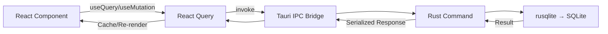
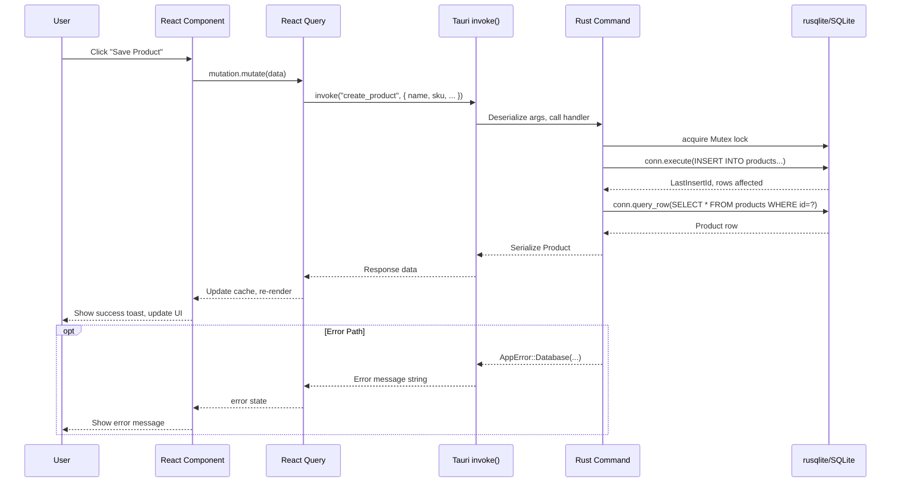
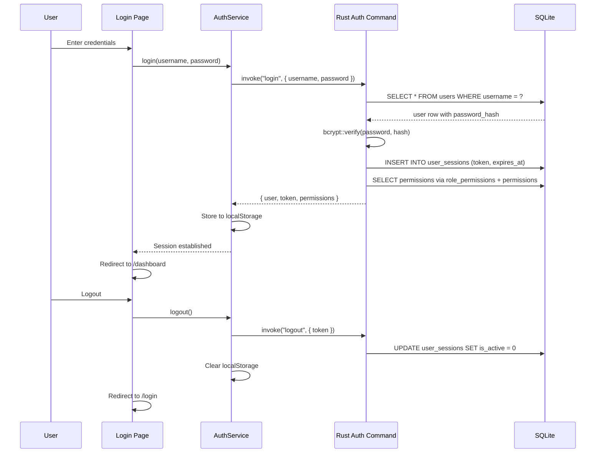

# Architecture

## Project Overview

**Inventory Gear** is a desktop inventory management application built with Tauri v2. It provides POS, CRM, inventory control, purchasing, and reporting for auto parts and general merchandise businesses. The app runs fully offline with a local SQLite database — no cloud dependency.

### Tech Stack

| Layer | Technology |
|---|---|
| Desktop Shell | Tauri v2 (Rust) |
| Frontend | React 18 + TypeScript |
| Bundler | Vite 5 |
| Routing | react-router-dom v6 (77+ routes) |
| State Management | Zustand (6 stores) + TanStack React Query |
| Styling | TailwindCSS + shadcn/ui primitives |
| i18n | i18next (18 namespaces, es/en) |
| Theming | next-themes (light/dark/system) |
| Forms | Custom field components + Zod validation |
| Backend | Rust (edition 2021) |
| Database | SQLite via rusqlite (v0.31, bundled) |
| Auth | bcrypt password hashing + session tokens |
| IPC | Tauri invoke system (291 commands) |

---

## Directory Structure

```
inventory-gear/
├── src/                          # Frontend source (React + TypeScript)
│   ├── App.tsx                   # Root component: providers, router, error boundary
│   ├── main.tsx                  # Entry point
│   ├── index.css                 # Global styles + Tailwind directives
│   ├── app/                      # App-level configuration
│   ├── assets/                   # Static assets (images, icons)
│   ├── components/               # Reusable React components
│   │   ├── ui/                   # shadcn/ui primitives (button, dialog, table, etc.)
│   │   ├── data-table/           # Generic DataTable with sort, filter, pagination
│   │   ├── dialogs/              # ConfirmDialog, PromptDialog, CRUD dialogs
│   │   ├── entity/               # EntityListPage, EntityFormPage, EntityDetailPage
│   │   ├── forms/                # Form field components (TextField, SelectField, etc.)
│   │   ├── auth-guards.tsx       # AuthenticatedRoute, GuestRoute, PermissionRoute
│   │   ├── permission-guard.tsx  # PermissionGuard, AnyPermissionGuard
│   │   ├── command-palette.tsx   # ⌘K command palette
│   │   ├── error-boundary.tsx    # React error boundary
│   │   ├── notification-center.tsx # Toast notification system
│   │   └── search-bar.tsx        # Global search
│   ├── features/                 # Feature-first modules (15 domains)
│   │   ├── auth/                 # Login page, auth forms
│   │   ├── admin/                # Admin dashboard, users, roles, settings, etc.
│   │   ├── crm/                  # Customer relationship management
│   │   ├── customers/            # Customer listing
│   │   ├── dashboard/            # Executive dashboard
│   │   ├── employees/            # Employee management
│   │   ├── help/                 # Help page
│   │   ├── inventory/            # Products, categories, brands, warehouses, etc.
│   │   ├── purchases/            # Purchase orders, requests, receipts, returns
│   │   ├── reports/              # All reporting modules (sales, inventory, etc.)
│   │   ├── sales/                # POS, quotes, cash register, returns
│   │   ├── settings/             # User preferences
│   │   ├── suppliers/            # Supplier management
│   │   ├── vehicles/             # Vehicle reference data
│   │   └── warehouse/            # Warehouse operations
│   ├── hooks/                    # Custom React hooks
│   │   ├── use-auth.ts           # Authentication hooks
│   │   ├── use-crud.ts           # TanStack Query CRUD operations
│   │   ├── use-data-table.ts     # DataTable state management
│   │   ├── use-entity.ts         # Entity form state (dirty tracking, save)
│   │   ├── use-filters.ts        # Filter management
│   │   ├── use-pagination.ts     # Pagination state
│   │   ├── use-permissions.ts    # Permission checking
│   │   ├── use-search.ts         # Debounced search
│   │   └── use-selection.ts      # Row selection
│   ├── i18n/                     # Internationalization
│   │   ├── config.ts             # i18next setup (18 ns, es/en)
│   │   └── locales/
│   │       ├── es/               # Spanish translations (18 files)
│   │       └── en/               # English translations (18 files)
│   ├── layouts/                  # Application shell
│   │   ├── app-shell.tsx         # Main layout: sidebar + topbar + content + statusbar
│   │   ├── sidebar.tsx           # Collapsible sidebar (64px/256px)
│   │   ├── top-bar.tsx           # Search, theme toggle, notifications, user menu
│   │   └── status-bar.tsx        # Connection status, DB info, version, clock
│   ├── lib/                      # Utilities
│   │   ├── tauri.ts              # Typed Tauri invoke wrappers (500+ functions)
│   │   ├── query-client.ts       # TanStack Query client config
│   │   ├── repository/           # BaseRepository abstract class
│   │   ├── validation/           # Zod schema factories, validators, errors
│   │   ├── export.ts             # CSV/JSON/XLSX export
│   │   ├── mappers.ts            # Data mapping utilities
│   │   ├── pagination.ts         # Pagination logic
│   │   ├── sorting.ts            # Sorting logic
│   │   ├── filtering.ts          # Filter logic
│   │   └── utils.ts              # General utilities (cn, formatCurrency, etc.)
│   ├── routes/
│   │   └── index.tsx             # All 77+ route definitions
│   ├── services/
│   │   ├── auth.service.ts       # Auth: login, logout, session management
│   │   ├── crud.service.ts       # Generic CRUD service with validation
│   │   └── permission.service.ts # Permission checking utilities
│   ├── stores/                   # Zustand stores
│   │   ├── auth.store.ts         # Auth state (user, token, permissions)
│   │   ├── theme.store.ts        # Theme preference (persisted)
│   │   ├── settings.store.ts     # UI settings (sidebar, command palette)
│   │   ├── notification.store.ts # In-app notifications
│   │   ├── language.store.ts     # Language preference (persisted)
│   │   └── dialog.store.ts       # Global dialog state
│   ├── styles/                   # Additional styles
│   └── types/                    # TypeScript type definitions
│       ├── index.ts              # All domain types (1753 lines)
│       ├── crud.ts               # Generic CRUD type definitions
│       └── inventory.ts          # Inventory-specific types
├── src-tauri/                    # Tauri backend (Rust)
│   └── src/
│       ├── main.rs               # Entry point
│       ├── lib.rs                # App setup: DB init, command registration (291 cmds)
│       ├── config.rs             # AppConfig (db path, version, log level)
│       ├── error.rs              # AppError enum (Database, Io, Serialization, etc.)
│       ├── db/
│       │   ├── mod.rs            # Public API
│       │   ├── connection.rs     # DbState (Arc<Mutex<Connection>>), init_database
│       │   ├── schema.rs         # 65 CREATE TABLE statements, schema version 8
│       │   └── seed.rs           # Seed data insertion
│       └── commands/             # 14 command modules
│           ├── mod.rs
│           ├── app.rs            # App info: version, health, greet, seed
│           ├── auth.rs           # Login, logout, session validation, permissions
│           ├── settings.rs       # App settings CRUD
│           ├── inventory.rs      # Categories, brands, manufacturers, suppliers,
│           │                     # warehouses, locations, products, movements
│           ├── customers.rs      # Customer CRUD, credit, communications, notes
│           ├── vehicles.rs       # Vehicle brands, models, generations, engines,
│           │                     # transmissions, fuels, customer vehicles
│           ├── compatibility.rs  # Product-vehicle compatibility
│           ├── reminders.rs      # Service reminders
│           ├── warranty.rs       # Product warranties
│           ├── crm.rs            # CRM dashboard
│           ├── sales.rs          # Sales, POS, quotes, cash register, receipts
│           ├── purchases.rs      # Purchase orders, requests, receipts, returns
│           ├── reports/          # 10 submodules: dashboard, sales, inventory,
│           │                     # purchasing, customers, suppliers, warehouse,
│           │                     # profitability, kpi, manage
│           └── admin/            # 10 submodules: dashboard, users, roles,
│                                 # settings, printers, devices, backups, database,
│                                 # diagnostics, audit, updates, license, maintenance
├── database/                     # TypeScript database layer
│   ├── schema.ts                 # Drizzle ORM schema definitions (7 tables)
│   └── seed/                     # Seed data pipeline (20 seed modules)
│       ├── run.ts                # Entry point
│       ├── index.ts              # Ordered seed runner
│       └── *.seed.ts             # Individual seed modules
├── docs/                         # Documentation
├── scripts/                      # Utility scripts
├── public/                       # Static public assets
├── package.json
├── vite.config.ts
└── drizzle.config.ts
```

---

## Frontend Architecture

### Component Tree

```mermaid
graph TD
    App[App.tsx] --> ThemeProvider[next-themes Provider]
    App --> QC[QueryClientProvider]
    App --> EB[ErrorBoundary]
    EB --> Router[RouterProvider]
    Router --> Login[/login - GuestRoute]
    Router --> Forbidden[/forbidden]
    Router --> Shell[/ - AuthenticatedRoute]
    Shell --> AS[AppShell]

    subgraph "Application Shell"
        AS --> SB[Sidebar - 64/256px]
        AS --> Main
        subgraph "Main Content Area"
            Main --> TB[TopBar]
            Main --> CP[CommandPalette ⌘K]
            Main --> Content[Outlet - Page Content]
            Main --> STB[StatusBar]
        end
    end

    subgraph "Page Content (Outlet)"
        Content --> DP[DashboardPage]
        Content --> IP[InventoryPages]
        Content --> SP[SalesPages]
        Content --> PP[PurchasingPages]
        Content --> CPG[CrmPages]
        Content --> RP[ReportsPages]
        Content --> AP[AdminPages]
    end

    subgraph "Feature Pages"
        IP --> IPList[EntityListPage]
        IP --> IPForm[EntityFormPage]
        IP --> IPDetail[EntityDetailPage]
        SP --> POS[PosPage]
        SP --> SQ[QuotePages]
        CPG --> CVD[CrmCustomerDetailPage]
    end

    subgraph "Reusable Components"
        IPList --> DT[DataTable]
        IPForm --> FF[FormFields]
        FF --> TF[TextField]
        FF --> SF[SelectField]
        FF --> CSF[CustomerSearchField]
        FF --> CF[CurrencyField]
        FF --> DF[DateField]
        DT --> PG[PermissionGuard]
    end

    TB --> NC[NotificationCenter]
    TB --> DH[DialogHost]
```

### Routing

77+ routes defined in `src/routes/index.tsx` using `createBrowserRouter` with a nested layout pattern:

- **Public routes** (`/login`, `/forbidden`) wrapped in `GuestRoute`
- **Authenticated routes** nested under `AppShell` wrapped in `AuthenticatedRoute`
- Route permissions enforced at the component level via `PermissionGuard`

**Route groups by feature:**

| Group | Routes | Count |
|---|---|---|
| Auth | `/login`, `/forbidden` | 2 |
| Dashboard | `/dashboard` | 1 |
| CRM | `/crm/*` (dashboard, customers, vehicles, compatibility, reminders, warranties, credit, notes) | 9 |
| Inventory | `/inventory/*` (dashboard, categories, brands, manufacturers, suppliers, warehouses, locations, movements, products) | 19 |
| Sales | `/sales/*` (list, POS, closeout, quotes, returns, register, receipts, detail) | 11 |
| Purchasing | `/purchases/*` (dashboard, orders, requests, receipts, returns, supplier-products, cost-history, reorder) | 13 |
| Customers | `/customers`, `/customers/:id` | 2 |
| Suppliers | `/suppliers` | 1 |
| Vehicles | `/vehicles` | 1 |
| Warehouse | `/warehouse` | 1 |
| Reports | `/reports/*` (dashboard, sales, inventory, purchasing, customers, suppliers, warehouses, profitability, KPIs, custom, scheduled, exports) | 12 |
| Admin | `/admin/*` (dashboard, users, roles, settings, printers, devices, backups, restore, database, diagnostics, audit, updates, licensing, maintenance, about) | 17 |
| Other | `/employees`, `/settings`, `/help` | 3 |
| Catch-all | `*` → redirect | 1 |

### State Management

**Zustand Stores** (6 stores):

| Store | Purpose | Persisted |
|---|---|---|
| `auth.store.ts` | User session, token, permissions | localStorage |
| `theme.store.ts` | Light/dark/system preference | localStorage |
| `settings.store.ts` | Sidebar collapsed, command palette open | localStorage |
| `notification.store.ts` | In-app notification queue | No |
| `language.store.ts` | Language preference | localStorage |
| `dialog.store.ts` | Global dialog state | No |

**React Query** handles all server-state (data fetched via Tauri invoke):

```typescript
const queryClient = new QueryClient({
  defaultOptions: {
    queries: {
      staleTime: 1000 * 60 * 5, // 5 min
      retry: 1,
      refetchOnWindowFocus: false,
    },
  },
})
```

### Internationalization

18 namespaces × 2 languages (es/en):

| Namespace | Purpose |
|---|---|
| `common` | App-wide labels, buttons, navigation |
| `auth` | Login, logout, session messages |
| `dashboard` | Executive dashboard |
| `inventory` | Products, categories, brands, warehouses |
| `sales` | POS, quotes, cash register |
| `purchases` | Purchase orders, requests, receipts |
| `customers` | Customer management |
| `suppliers` | Supplier management |
| `vehicles` | Vehicle reference data |
| `warehouse` | Warehouse operations |
| `crm` | CRM dashboard, compatibility, reminders |
| `reports` | All reporting modules |
| `settings` | User and app settings |
| `employees` | Employee management |
| `admin` | Admin dashboard, users, roles |
| `validation` | Form validation messages |
| `errors` | Error messages |
| `help` | Help content |

### Theming

Three modes via `next-themes` with `ThemeProvider`:

- **Light** — default light palette
- **Dark** — dark palette
- **System** — follows OS preference via `prefers-color-scheme`

Toggled via the TopBar theme button (cycle: light → dark → system).

### RBAC & Authorization

Three layers of access control:

**1. Route Guards** (`src/components/auth-guards.tsx`):
- `AuthenticatedRoute` — redirects to `/login` if unauthenticated
- `GuestRoute` — redirects to `/dashboard` if already authenticated
- `PermissionRoute` — checks specific permission, redirects to `/forbidden`

**2. Component Guards** (`src/components/permission-guard.tsx`):
- `PermissionGuard` — renders children only if user has the required permission
- `AnyPermissionGuard` — renders children if user has any of the listed permissions

**3. Protected Actions** (`src/components/protected-button.tsx`):
- `ProtectedButton` — disables/hides buttons based on permissions

**Permission model:**
- Permissions are strings like `"inventory.view"`, `"sales.create"`, `"admin.users.manage"`
- The `PermissionService` (`src/services/permission.service.ts`) checks against the user's permission array
- Each role maps to a set of permissions via the `role_permissions` join table

---

## Backend Architecture

### Tauri v2 IPC



### DbState — Global Database Connection

```rust
static DB_STATE: OnceLock<DbState> = OnceLock::new();

#[derive(Debug, Clone)]
pub struct DbState {
    pub conn: Arc<Mutex<Connection>>,
}
```

- **OnceLock** ensures single initialization at app startup
- **Arc<Mutex\<Connection\>>** provides thread-safe shared access to the SQLite connection
- Commands acquire the lock, execute SQL, and return serialized results

### AppError Enum

```rust
pub enum AppError {
    Database(rusqlite::Error),
    Io(std::io::Error),
    Serialization(serde_json::Error),
    Config(String),
    NotFound(String),
    Internal(String),
}
```

Implements `Serialize` (via `to_string()`) so errors propagate cleanly through Tauri IPC.

### Command Modules (14 modules, 291 commands)

| Module | File(s) | Commands | Domain |
|---|---|---|---|
| `app` | `app.rs` | 4 | Version, health, greet, seeds |
| `auth` | `auth.rs` | 6 | Login, logout, session, permissions |
| `settings` | `settings.rs` | 4 | Get/update settings |
| `inventory` | `inventory.rs` | 20 | Categories, brands, manufacturers, suppliers, warehouses, locations, products, movements |
| `customers` | `customers.rs` | 16 | Customer CRUD, credit, comms, notes, timeline |
| `vehicles` | `vehicles.rs` | 15 | Vehicle reference + customer vehicles |
| `compatibility` | `compatibility.rs` | 5 | Product-vehicle compatibility |
| `reminders` | `reminders.rs` | 5 | Service reminders |
| `warranty` | `warranty.rs` | 5 | Warranties |
| `crm` | `crm.rs` | 2 | CRM dashboard |
| `sales` | `sales.rs` | 23 | Sales, POS, quotes, cash register, receipts |
| `purchases` | `purchases.rs` | 18 | Purchase orders, requests, receipts, returns |
| `reports` | `reports/` (10 files) | ~60 | Executive dashboard, sales, inventory, purchasing, customers, suppliers, warehouse, profitability, KPIs, saved/scheduled |
| `admin` | `admin/` (10 files) | ~85 | Dashboard, users, roles, settings, printers, devices, backups, database, diagnostics, audit, updates, license, maintenance |

### Config Management

```rust
pub struct AppConfig {
    pub app_name: String,    // "Inventory Gear"
    pub version: String,     // env!("CARGO_PKG_VERSION") → 0.1.0
    pub db_path: PathBuf,    // ~/.local/share/inventory-gear/inventory_gear.db
    pub log_level: String,   // "info"
}
```

Database path defaults to `dirs::data_local_dir()/inventory-gear/inventory_gear.db`.

---

## Data Flow



### CRUD Framework

The application uses a layered CRUD architecture defined in `src/types/crud.ts` and documented in `docs/CRUD_FRAMEWORK.md`:

```
Repository layer  →  CrudService layer  →  useCrud hook  →  Page Component
(abstract class)     (validation/mapping)   (TanStack Query)  (EntityListPage)
```

**Key types:**
- `CrudEntity` — base interface with `id`
- `PaginatedResult<T>` — `{ data, total, page, pageSize, totalPages }`
- `TableColumn<T>` — column definition with sorting, filtering, searching
- `FormField` — unified field definition for auto-generated forms

### Entity Components

Three reusable page layouts in `src/components/entity/`:

- **`EntityListPage`** — header + breadcrumb + data table + toolbar (add, refresh, export, import)
- **`EntityFormPage`** — back button + header + form fields + action bar (save, delete, archive)
- **`EntityDetailPage`** — back button + edit button + info cards + loading/error states

### Form Components Layer

14 form field components in `src/components/forms/`:

| Component | Type | Features |
|---|---|---|
| `TextField` | Text input | label, error, description, required |
| `NumberField` | Number input | min, max, step |
| `EmailField` | Email input | mail icon, email validation |
| `PhoneField` | Phone input | phone icon |
| `CurrencyField` | Currency input | $ prefix, decimal handling |
| `TextareaField` | Multi-line text | resizable |
| `SelectField` | Dropdown | Radix Select, options |
| `CheckboxField` | Checkbox | with label |
| `SwitchField` | Toggle | boolean |
| `DateField` | Date picker | input type="date" |
| `CustomerSearchField` | Customer combobox | debounced search, quick-add dialog |
| `FormField` | Generic wrapper | consistent label/error/description layout |

### DataTable Component

`src/components/data-table/data-table.tsx` — full-featured generic table:

```
DataTable<T>
├── Toolbar
│   ├── Search input (debounced 300ms)
│   ├── Add button (onAdd)
│   ├── Refresh button (onRefresh)
│   ├── Export button (onExport)
│   ├── Import button (onImport)
│   └── Column visibility dropdown
├── Table
│   ├── Sortable headers (click to cycle: asc → desc → none)
│   ├── Row click handler
│   ├── Row selection (checkboxes)
│   └── Sticky header
├── Bulk actions bar
├── Pagination
│   ├── First, Prev, Next, Last
│   ├── Page numbers
│   ├── Page size selector
│   └── Results counter
└── States
    ├── Loading skeleton
    ├── Error with retry
    ├── Empty state
    └── Normal data
```

---

## Application Shell

### Layout Structure

```mermaid
graph TD
    subgraph "AppShell"
        direction LR
        SB[Sidebar<br/>Fixed left<br/>64px|256px]
        subgraph "Main Area"
            TB[TopBar<br/>Sticky top, h-14]
            CT[Content<br/>Overflow-auto, p-6]
            STB[StatusBar<br/>Fixed bottom, h-7]
        end
    end
```

**Sidebar** (`src/layouts/sidebar.tsx`):
- Collapsible between 64px (icons only) and 256px (icons + labels)
- Navigation groups: Main (dashboard, sales, inventory, purchases, CRM, suppliers, warehouse) and Secondary (reports, admin, employees, settings, help)
- Expandable sub-menus with collapse/expand toggle
- Active route highlighting, tooltips in collapsed mode
- Logo branding ("IG") at top, collapse toggle button at bottom

**TopBar** (`src/layouts/top-bar.tsx`):
- Current page title
- Search button → opens CommandPalette (⌘K)
- Theme toggle (light/dark/system cycle)
- Notification bell with unread badge → NotificationPanel popover
- User dropdown with avatar, name, email, profile link, seed data trigger, logout

**StatusBar** (`src/layouts/status-bar.tsx`):
- Connection status indicator (Wifi icon, green = connected)
- Database indicator (local badge)
- App version (0.1.0)
- Live clock (updated every second via setInterval)

**CommandPalette** (`src/components/command-palette.tsx`):
- Triggered by ⌘K / Ctrl+K
- Dialog overlay with search input
- Filters commands by label
- Categories: Navigation, Appearance
- Escape to close

---

## Security Model

### Authentication



- **Password hashing**: bcrypt (cost factor 12 default)
- **Session tokens**: UUID v4, stored in `user_sessions` table with expiration
- **Validation**: On app startup, `checkSession` verifies token exists and hasn't expired
- **Session persistence**: Token + user info stored in localStorage under `inventory-gear-session`

### Role-Based Permissions

Five default roles:

| Role | Description |
|---|---|
| `owner` | Full system access, all permissions |
| `administrator` | Management access, user/role admin |
| `cashier` | POS operations, sales viewing |
| `warehouse` | Inventory management, stock movements |
| `purchasing` | Purchase orders, supplier management |
| `viewer` | Read-only access to reports and data |

Permissions are stored in the `permissions` table and linked to roles via the `role_permissions` join table. Each user has exactly one role.

---

## Seed Data Pipeline

Defined in `database/seed/` with 20 seed modules running in dependency order:

```
database/seed/
├── run.ts                 # Entry: auto-detects DB or --db override
├── index.ts               # Orchestrator: runs seeds in order
├── helpers.ts             # Shared utilities
├── validate.seed.ts       # 18 health checks (all pass)
├── categories.seed.ts     # 30 categories
├── brands.seed.ts         # 31 brands
├── suppliers.seed.ts      # 24 suppliers
├── warehouses.seed.ts     # 4 warehouses
├── locations.seed.ts      # 112 storage locations
├── products.seed.ts       # 144 products with barcodes/pricing
├── compatibility.seed.ts  # 96 product-vehicle mappings
├── customers.seed.ts      # 347 customers
├── users.seed.ts          # 6 demo users
├── movements.seed.ts      # ~4,500 inventory movements
├── transfers.seed.ts      # 129 transfers
├── adjustments.seed.ts    # Inventory adjustments
├── reservations.seed.ts   # 50 reservations
├── sales.seed.ts          # 500 sales, 2,207 items, ~$804k revenue
├── payments.seed.ts       # Inline with sales
├── quotes.seed.ts         # 100 quotes
├── audit.seed.ts          # ~8,900 audit entries
├── vehicles.seed.ts       # 20 brands, 53 models, 30 gens, 26 engines,
│                          # 9 transmissions, 4 fuels, 300 customer vehicles
└── dashboard.seed.ts      # Uses existing data
```

All seed modules are additive (check for existing data before inserting).
