# Database Schema

## Overview

Inventory Gear uses **SQLite** (via rusqlite v0.31 with the `bundled` feature) as its database engine.

### Connection

- **Path**: `~/.local/share/inventory-gear/inventory_gear.db`
- **Pragmas** (set on connection open):
  - `PRAGMA journal_mode=WAL` — Write-Ahead Logging for concurrent reads
  - `PRAGMA foreign_keys=ON` — Enforce referential integrity

### Schema Versioning

- Version tracked via `PRAGMA user_version` (currently **version 8**)
- On startup, `create_tables()` compares `user_version` against `SCHEMA_VERSION`
- If the stored version is lower, the schema drops **all existing tables** (destructive migration) and recreates them
- Migration is destructive: `DROP TABLE IF EXISTS ...` for all 65 tables, then `CREATE TABLE IF NOT EXISTS ...`

### Convention Notes

- All tables use `id INTEGER PRIMARY KEY AUTOINCREMENT`
- Timestamps use ISO 8601 text format: `TEXT NOT NULL DEFAULT (datetime('now'))`
- Boolean values use `INTEGER NOT NULL DEFAULT 0/1`
- Monetary values use `REAL`
- Soft-delete patterns use `is_active INTEGER NOT NULL DEFAULT 1`
- Table names use `snake_case`, column names use `snake_case`

---

## Entity-Relationship Overview

```mermaid
erDiagram
    %% Auth / RBAC
    roles ||--o{ users : "has"
    roles ||--o{ role_permissions : "grants"
    permissions ||--o{ role_permissions : "assigned"
    users ||--o{ user_sessions : "has"
    users ||--o{ audit_logs : "audits"

    %% Inventory Core
    categories ||--o{ categories : "self-ref parent"
    categories ||--o{ products : "categorizes"
    brands ||--o{ products : "brands"
    manufacturers ||--o{ products : "manufactures"
    suppliers ||--o{ products : "supplies"
    warehouses ||--o{ storage_locations : "contains"
    warehouses ||--o{ products : "stocks"
    storage_locations ||--o{ products : "locates"
    products ||--o{ product_images : "has"
    products ||--o{ inventory_movements : "tracks"
    products ||--o{ sale_items : "sold in"
    products ||--o{ purchase_order_items : "ordered in"
    products ||--o{ supplier_products : "sourced from"
    products ||--o{ product_cost_history : "cost changes"
    products ||--o{ product_vehicle_compatibility : "fits"

    %% Customers / CRM
    customers ||--o{ sales : "buys"
    customers ||--o{ customer_vehicles : "owns"
    customers ||--o{ customer_notes : "has notes"
    customers ||--o{ customer_timeline : "has timeline"
    customers ||--o{ communication_log : "communicates"
    customers ||--o{ credit_accounts : "has credit"
    customers ||--o{ service_reminders : "scheduled"
    customers ||--o{ warranties : "covered by"
    credit_accounts ||--o{ credit_transactions : "records"

    %% Vehicle Reference
    vehicle_brands ||--o{ vehicle_models : "has"
    vehicle_models ||--o{ vehicle_generations : "has"
    customer_vehicles ||--o{ vehicle_brands : "references"
    customer_vehicles ||--o{ vehicle_models : "references"
    customer_vehicles ||--o{ vehicle_generations : "references"
    customer_vehicles ||--o{ vehicle_engines : "uses"
    customer_vehicles ||--o{ vehicle_transmissions : "uses"
    customer_vehicles ||--o{ vehicle_fuels : "uses"

    %% Sales / POS
    sales ||--o{ sale_items : "contains"
    sales ||--o{ sale_payments : "pays"
    sales ||--o{ receipts : "printed"
    quotes ||--o{ quote_items : "contains"
    users ||--o{ cash_register_sessions : "opens"
    users ||--o{ daily_closings : "closes"

    %% Purchasing
    purchase_orders ||--o{ purchase_order_items : "contains"
    purchase_orders ||--o{ purchase_receipts : "received"
    purchase_orders ||--o{ purchase_returns : "returned"
    suppliers ||--o{ purchase_orders : "supplies"
    suppliers ||--o{ purchase_returns : "returns"
    purchase_receipts ||--o{ purchase_receipt_items : "contains"
    purchase_returns ||--o{ purchase_return_items : "contains"

    %% Reports / Admin
    saved_reports ||--o{ scheduled_reports : "schedules"
    users ||--o{ dashboard_preferences : "configures"
```



---

## Complete Table Reference

### Domain 1: Auth / RBAC (6 tables)

---

#### `roles`

Defines access roles. Includes system roles (owner, administrator, cashier, warehouse, purchasing, viewer).

| Column | Type | Nullable | Default | Notes |
|---|---|---|---|---|
| `id` | INTEGER | NOT NULL | AUTOINCREMENT | Primary key |
| `name` | TEXT | NOT NULL | — | Unique, e.g. "owner", "cashier" |
| `description` | TEXT | YES | — | Human-readable description |
| `is_system` | INTEGER | NOT NULL | 0 | System roles cannot be deleted |
| `is_active` | INTEGER | NOT NULL | 1 | Soft-delete flag |
| `created_at` | TEXT | NOT NULL | datetime('now') | |
| `updated_at` | TEXT | NOT NULL | datetime('now') | |

- **PK**: `id`
- **UQ**: `name`
- **Indexes**: None explicit (PK covers lookup)

---

#### `permissions`

Individual permission keys used for RBAC.

| Column | Type | Nullable | Default | Notes |
|---|---|---|---|---|
| `id` | INTEGER | NOT NULL | AUTOINCREMENT | Primary key |
| `key` | TEXT | NOT NULL | — | Unique, e.g. "inventory.view", "sales.create" |
| `name` | TEXT | NOT NULL | — | Human-readable name |
| `group_name` | TEXT | NOT NULL | '' | Grouping category (e.g. "Inventory", "Sales") |
| `description` | TEXT | YES | — | |
| `created_at` | TEXT | NOT NULL | datetime('now') | |

- **PK**: `id`
- **UQ**: `key`

---

#### `role_permissions`

Many-to-many join between roles and permissions.

| Column | Type | Nullable | Default | Notes |
|---|---|---|---|---|
| `id` | INTEGER | NOT NULL | AUTOINCREMENT | Primary key |
| `role_id` | INTEGER | NOT NULL | — | FK → roles(id) ON DELETE CASCADE |
| `permission_id` | INTEGER | NOT NULL | — | FK → permissions(id) ON DELETE CASCADE |
| `created_at` | TEXT | NOT NULL | datetime('now') | |

- **PK**: `id`
- **UQ**: `(role_id, permission_id)`
- **FK**: `role_id` → `roles(id)` CASCADE
- **FK**: `permission_id` → `permissions(id)` CASCADE

---

#### `users`

Application users with credentials and account state.

| Column | Type | Nullable | Default | Notes |
|---|---|---|---|---|
| `id` | INTEGER | NOT NULL | AUTOINCREMENT | Primary key |
| `username` | TEXT | NOT NULL | — | Unique, login identifier |
| `email` | TEXT | NOT NULL | — | Unique |
| `password_hash` | TEXT | NOT NULL | — | bcrypt hash |
| `full_name` | TEXT | NOT NULL | — | Display name |
| `phone` | TEXT | YES | — | |
| `role_id` | INTEGER | YES | — | FK → roles(id) |
| `is_active` | INTEGER | NOT NULL | 1 | Soft-delete / disable |
| `is_locked` | INTEGER | NOT NULL | 0 | Account lockout |
| `locked_until` | TEXT | YES | — | Temporal lock expiry |
| `failed_login_attempts` | INTEGER | NOT NULL | 0 | Brute-force protection |
| `password_expires_at` | TEXT | YES | — | Password expiration |
| `password_change_required` | INTEGER | NOT NULL | 0 | Force password change on next login |
| `last_login_at` | TEXT | YES | — | |
| `notes` | TEXT | YES | — | |
| `created_by` | INTEGER | YES | — | FK → users(id) ON DELETE SET NULL |
| `created_at` | TEXT | NOT NULL | datetime('now') | |
| `updated_at` | TEXT | NOT NULL | datetime('now') | |

- **PK**: `id`
- **UQ**: `username`, `email`
- **FK**: `role_id` → `roles(id)`
- **FK**: `created_by` → `users(id)` SET NULL

---

#### `user_sessions`

Active session tokens for authentication.

| Column | Type | Nullable | Default | Notes |
|---|---|---|---|---|
| `id` | INTEGER | NOT NULL | AUTOINCREMENT | Primary key |
| `user_id` | INTEGER | NOT NULL | — | FK → users(id) ON DELETE CASCADE |
| `token` | TEXT | NOT NULL | — | UUID v4, unique |
| `expires_at` | TEXT | NOT NULL | — | Session expiry timestamp |
| `is_active` | INTEGER | NOT NULL | 1 | Soft-delete for logout |
| `created_at` | TEXT | NOT NULL | datetime('now') | |

- **PK**: `id`
- **UQ**: `token`
- **FK**: `user_id` → `users(id)` CASCADE

---

#### `settings`

Key-value application settings.

| Column | Type | Nullable | Default | Notes |
|---|---|---|---|---|
| `id` | INTEGER | NOT NULL | AUTOINCREMENT | Primary key |
| `key` | TEXT | NOT NULL | — | Unique setting key |
| `value` | TEXT | YES | — | Setting value |
| `group_name` | TEXT | NOT NULL | 'general' | Category group |
| `setting_type` | TEXT | NOT NULL | 'string' | Type hint (string, number, boolean, json) |
| `description` | TEXT | YES | — | |
| `is_system` | INTEGER | NOT NULL | 0 | System settings hidden from UI |
| `created_at` | TEXT | NOT NULL | datetime('now') | |
| `updated_at` | TEXT | NOT NULL | datetime('now') | |

- **PK**: `id`
- **UQ**: `key`

---

### Domain 2: Inventory (14 tables)

---

#### `categories`

Hierarchical product categories (self-referencing via `parent_id`).

| Column | Type | Nullable | Default | Notes |
|---|---|---|---|---|
| `id` | INTEGER | NOT NULL | AUTOINCREMENT | Primary key |
| `name` | TEXT | NOT NULL | — | Category name |
| `description` | TEXT | YES | — | |
| `parent_id` | INTEGER | YES | — | FK → categories(id), self-referencing |
| `sort_order` | INTEGER | NOT NULL | 0 | Display order |
| `is_active` | INTEGER | NOT NULL | 1 | Soft-delete |
| `created_at` | TEXT | NOT NULL | datetime('now') | |
| `updated_at` | TEXT | NOT NULL | datetime('now') | |

- **PK**: `id`
- **FK**: `parent_id` → `categories(id)`

---

#### `brands`

Product brands (e.g. Bosch, NGK, KYB, SKF).

| Column | Type | Nullable | Default | Notes |
|---|---|---|---|---|
| `id` | INTEGER | NOT NULL | AUTOINCREMENT | Primary key |
| `name` | TEXT | NOT NULL | — | Unique |
| `description` | TEXT | YES | — | |
| `country` | TEXT | YES | — | Country of origin |
| `website` | TEXT | YES | — | |
| `logo_url` | TEXT | YES | — | |
| `is_active` | INTEGER | NOT NULL | 1 | |
| `created_at` | TEXT | NOT NULL | datetime('now') | |
| `updated_at` | TEXT | NOT NULL | datetime('now') | |

- **PK**: `id`
- **UQ**: `name`

---

#### `manufacturers`

Product manufacturers.

| Column | Type | Nullable | Default | Notes |
|---|---|---|---|---|
| `id` | INTEGER | NOT NULL | AUTOINCREMENT | Primary key |
| `name` | TEXT | NOT NULL | — | Unique |
| `country` | TEXT | YES | — | |
| `phone` | TEXT | YES | — | |
| `email` | TEXT | YES | — | |
| `website` | TEXT | YES | — | |
| `notes` | TEXT | YES | — | |
| `is_active` | INTEGER | NOT NULL | 1 | |
| `created_at` | TEXT | NOT NULL | datetime('now') | |
| `updated_at` | TEXT | NOT NULL | datetime('now') | |

- **PK**: `id`
- **UQ**: `name`

---

#### `suppliers`

Product suppliers.

| Column | Type | Nullable | Default | Notes |
|---|---|---|---|---|
| `id` | INTEGER | NOT NULL | AUTOINCREMENT | Primary key |
| `company_name` | TEXT | NOT NULL | — | |
| `contact_person` | TEXT | YES | — | |
| `phone` | TEXT | YES | — | |
| `mobile` | TEXT | YES | — | |
| `email` | TEXT | YES | — | |
| `website` | TEXT | YES | — | |
| `tax_number` | TEXT | YES | — | Tax ID (RUC/NIT) |
| `address` | TEXT | YES | — | |
| `city` | TEXT | YES | — | |
| `state` | TEXT | YES | — | |
| `postal_code` | TEXT | YES | — | |
| `country` | TEXT | YES | 'ID' | Default Indonesia |
| `notes` | TEXT | YES | — | |
| `is_active` | INTEGER | NOT NULL | 1 | |
| `created_at` | TEXT | NOT NULL | datetime('now') | |
| `updated_at` | TEXT | NOT NULL | datetime('now') | |

- **PK**: `id`

---

#### `warehouses`

Physical warehouse locations.

| Column | Type | Nullable | Default | Notes |
|---|---|---|---|---|
| `id` | INTEGER | NOT NULL | AUTOINCREMENT | Primary key |
| `name` | TEXT | NOT NULL | — | Unique |
| `code` | TEXT | NOT NULL | — | Unique, short code |
| `address` | TEXT | YES | — | |
| `city` | TEXT | YES | — | |
| `state` | TEXT | YES | — | |
| `country` | TEXT | YES | 'ID' | |
| `manager` | TEXT | YES | — | |
| `phone` | TEXT | YES | — | |
| `is_active` | INTEGER | NOT NULL | 1 | |
| `created_at` | TEXT | NOT NULL | datetime('now') | |
| `updated_at` | TEXT | NOT NULL | datetime('now') | |

- **PK**: `id`
- **UQ**: `name`, `code`

---

#### `storage_locations`

Bin/shelf locations within warehouses.

| Column | Type | Nullable | Default | Notes |
|---|---|---|---|---|
| `id` | INTEGER | NOT NULL | AUTOINCREMENT | Primary key |
| `warehouse_id` | INTEGER | NOT NULL | — | FK → warehouses(id) ON DELETE CASCADE |
| `zone` | TEXT | YES | — | e.g. "A", "B" |
| `aisle` | TEXT | YES | — | |
| `shelf` | TEXT | YES | — | |
| `bin` | TEXT | YES | — | |
| `code` | TEXT | NOT NULL | — | Unique, e.g. "WH1-A-01-01" |
| `description` | TEXT | YES | — | |
| `is_active` | INTEGER | NOT NULL | 1 | |
| `created_at` | TEXT | NOT NULL | datetime('now') | |
| `updated_at` | TEXT | NOT NULL | datetime('now') | |

- **PK**: `id`
- **UQ**: `code`
- **FK**: `warehouse_id` → `warehouses(id)` CASCADE

---

#### `products`

Core product inventory table. Links to category, brand, manufacturer, supplier, warehouse, and storage location.

| Column | Type | Nullable | Default | Notes |
|---|---|---|---|---|
| `id` | INTEGER | NOT NULL | AUTOINCREMENT | Primary key |
| `name` | TEXT | NOT NULL | — | Product name |
| `sku` | TEXT | NOT NULL | — | Unique SKU |
| `barcode` | TEXT | YES | — | EAN/UPC barcode |
| `oem_number` | TEXT | YES | — | OEM reference number |
| `internal_code` | TEXT | YES | — | Internal catalog code |
| `description` | TEXT | YES | — | |
| `category_id` | INTEGER | YES | — | FK → categories(id) |
| `brand_id` | INTEGER | YES | — | FK → brands(id) |
| `manufacturer_id` | INTEGER | YES | — | FK → manufacturers(id) |
| `supplier_id` | INTEGER | YES | — | FK → suppliers(id) (preferred supplier) |
| `cost_price` | REAL | NOT NULL | 0 | Purchase cost |
| `sale_price` | REAL | NOT NULL | 0 | Retail sale price |
| `wholesale_price` | REAL | NOT NULL | 0 | Wholesale price |
| `suggested_retail_price` | REAL | NOT NULL | 0 | MSRP |
| `tax_rate` | REAL | NOT NULL | 0 | Tax percentage |
| `stock_quantity` | INTEGER | NOT NULL | 0 | Current stock |
| `min_stock_level` | INTEGER | NOT NULL | 0 | Minimum before reorder |
| `max_stock_level` | INTEGER | NOT NULL | 0 | Maximum desired |
| `reorder_point` | INTEGER | NOT NULL | 0 | Qty triggering reorder |
| `unit` | TEXT | NOT NULL | 'pcs' | Unit of measure |
| `weight` | REAL | YES | — | Weight in kg |
| `warehouse_id` | INTEGER | YES | — | FK → warehouses(id) |
| `storage_location_id` | INTEGER | YES | — | FK → storage_locations(id) |
| `image_url` | TEXT | YES | — | Primary image path |
| `is_active` | INTEGER | NOT NULL | 1 | Soft-delete |
| `is_discontinued` | INTEGER | NOT NULL | 0 | Discontinued flag |
| `created_at` | TEXT | NOT NULL | datetime('now') | |
| `updated_at` | TEXT | NOT NULL | datetime('now') | |

- **PK**: `id`
- **UQ**: `sku`
- **FK**: `category_id` → `categories(id)`
- **FK**: `brand_id` → `brands(id)`
- **FK**: `manufacturer_id` → `manufacturers(id)`
- **FK**: `supplier_id` → `suppliers(id)`
- **FK**: `warehouse_id` → `warehouses(id)`
- **FK**: `storage_location_id` → `storage_locations(id)`

---

#### `product_images`

Product image gallery.

| Column | Type | Nullable | Default | Notes |
|---|---|---|---|---|
| `id` | INTEGER | NOT NULL | AUTOINCREMENT | Primary key |
| `product_id` | INTEGER | NOT NULL | — | FK → products(id) ON DELETE CASCADE |
| `file_path` | TEXT | NOT NULL | — | Path to image file |
| `is_primary` | INTEGER | NOT NULL | 0 | Primary/thumbnail image |
| `sort_order` | INTEGER | NOT NULL | 0 | Display order |
| `created_at` | TEXT | NOT NULL | datetime('now') | |

- **PK**: `id`
- **FK**: `product_id` → `products(id)` CASCADE

---

#### `inventory_movements`

Audit trail of all stock changes (sales, purchases, adjustments, transfers).

| Column | Type | Nullable | Default | Notes |
|---|---|---|---|---|
| `id` | INTEGER | NOT NULL | AUTOINCREMENT | Primary key |
| `product_id` | INTEGER | NOT NULL | — | FK → products(id) ON DELETE CASCADE |
| `warehouse_id` | INTEGER | YES | — | FK → warehouses(id) SET NULL |
| `quantity` | INTEGER | NOT NULL | — | Positive = inbound, negative = outbound |
| `type` | TEXT | NOT NULL | 'adjustment' | sale, purchase, transfer, adjustment, return |
| `reference_type` | TEXT | YES | — | Entity type (sale, po, transfer, etc.) |
| `reference_id` | TEXT | YES | — | Entity ID reference |
| `notes` | TEXT | YES | — | |
| `created_by` | INTEGER | YES | — | FK → users(id) SET NULL |
| `created_at` | TEXT | NOT NULL | datetime('now') | |

- **PK**: `id`
- **FK**: `product_id` → `products(id)` CASCADE
- **FK**: `warehouse_id` → `warehouses(id)` SET NULL
- **FK**: `created_by` → `users(id)` SET NULL

---

#### `product_vehicle_compatibility`

Links products to compatible vehicle configurations.

| Column | Type | Nullable | Default | Notes |
|---|---|---|---|---|
| `id` | INTEGER | NOT NULL | AUTOINCREMENT | Primary key |
| `product_id` | INTEGER | NOT NULL | — | FK → products(id) ON DELETE CASCADE |
| `brand_id` | INTEGER | YES | — | FK → vehicle_brands(id) |
| `model_id` | INTEGER | YES | — | FK → vehicle_models(id) |
| `generation_id` | INTEGER | YES | — | FK → vehicle_generations(id) |
| `engine_id` | INTEGER | YES | — | FK → vehicle_engines(id) |
| `transmission_id` | INTEGER | YES | — | FK → vehicle_transmissions(id) |
| `year_start` | INTEGER | YES | — | Start year of compatibility |
| `year_end` | INTEGER | YES | — | End year of compatibility |
| `notes` | TEXT | YES | — | |
| `created_at` | TEXT | NOT NULL | datetime('now') | |

- **PK**: `id`
- **FK**: `product_id` → `products(id)` CASCADE
- **FK**: `brand_id` → `vehicle_brands(id)`
- **FK**: `model_id` → `vehicle_models(id)`
- **FK**: `generation_id` → `vehicle_generations(id)`
- **FK**: `engine_id` → `vehicle_engines(id)`
- **FK**: `transmission_id` → `vehicle_transmissions(id)`

---

#### `product_cost_history`

Tracks changes to product cost prices over time.

| Column | Type | Nullable | Default | Notes |
|---|---|---|---|---|
| `id` | INTEGER | NOT NULL | AUTOINCREMENT | Primary key |
| `product_id` | INTEGER | NOT NULL | — | FK → products(id) ON DELETE CASCADE |
| `supplier_id` | INTEGER | YES | — | FK → suppliers(id) |
| `purchase_order_id` | INTEGER | YES | — | FK → purchase_orders(id) |
| `old_cost` | REAL | NOT NULL | 0 | Previous cost |
| `new_cost` | REAL | NOT NULL | 0 | New cost |
| `quantity` | INTEGER | NOT NULL | 0 | Quantity purchased at this cost |
| `created_by` | INTEGER | YES | — | FK → users(id) |
| `created_at` | TEXT | NOT NULL | datetime('now') | |

- **PK**: `id`
- **FK**: `product_id` → `products(id)` CASCADE
- **FK**: `supplier_id` → `suppliers(id)`
- **FK**: `purchase_order_id` → `purchase_orders(id)`
- **FK**: `created_by` → `users(id)`

---

#### `supplier_products`

Maps products to their suppliers with supplier-specific SKU and pricing.

| Column | Type | Nullable | Default | Notes |
|---|---|---|---|---|
| `id` | INTEGER | NOT NULL | AUTOINCREMENT | Primary key |
| `supplier_id` | INTEGER | NOT NULL | — | FK → suppliers(id) ON DELETE CASCADE |
| `product_id` | INTEGER | NOT NULL | — | FK → products(id) ON DELETE CASCADE |
| `supplier_sku` | TEXT | YES | — | Supplier's SKU for this product |
| `is_preferred` | INTEGER | NOT NULL | 0 | Preferred supplier flag |
| `minimum_order_quantity` | INTEGER | NOT NULL | 1 | MOQ |
| `lead_time_days` | INTEGER | NOT NULL | 1 | Typical lead time |
| `default_cost` | REAL | NOT NULL | 0 | Supplier-specific cost |
| `currency` | TEXT | NOT NULL | 'BOB' | Currency code |
| `status` | TEXT | NOT NULL | 'active' | active, inactive, discontinued |
| `created_at` | TEXT | NOT NULL | datetime('now') | |
| `updated_at` | TEXT | NOT NULL | datetime('now') | |

- **PK**: `id`
- **UQ**: `(supplier_id, product_id)`
- **FK**: `supplier_id` → `suppliers(id)` CASCADE
- **FK**: `product_id` → `products(id)` CASCADE

---

### Domain 3: Sales / POS (6 tables)

---

#### `sales`

Point-of-sale transactions.

| Column | Type | Nullable | Default | Notes |
|---|---|---|---|---|
| `id` | INTEGER | NOT NULL | AUTOINCREMENT | Primary key |
| `sale_number` | TEXT | NOT NULL | — | Unique, human-readable |
| `receipt_number` | TEXT | YES | — | Printed receipt number |
| `customer_id` | INTEGER | YES | — | FK → customers(id) |
| `user_id` | INTEGER | YES | — | FK → users(id) (cashier) |
| `warehouse_id` | INTEGER | YES | — | FK → warehouses(id) |
| `subtotal` | REAL | NOT NULL | 0 | Before tax/discount |
| `tax_rate` | REAL | NOT NULL | 0 | Applied tax rate |
| `tax_amount` | REAL | NOT NULL | 0 | Calculated tax |
| `discount_amount` | REAL | NOT NULL | 0 | Total discount |
| `total` | REAL | NOT NULL | 0 | Grand total |
| `payment_method` | TEXT | NOT NULL | 'cash' | cash, card, transfer, mixed |
| `payment_status` | TEXT | NOT NULL | 'paid' | paid, partial, pending, refunded |
| `notes` | TEXT | YES | — | |
| `created_at` | TEXT | NOT NULL | datetime('now') | |
| `updated_at` | TEXT | NOT NULL | datetime('now') | |

- **PK**: `id`
- **UQ**: `sale_number`
- **FK**: `customer_id` → `customers(id)`
- **FK**: `user_id` → `users(id)`
- **FK**: `warehouse_id` → `warehouses(id)`

---

#### `sale_items`

Individual line items within a sale.

| Column | Type | Nullable | Default | Notes |
|---|---|---|---|---|
| `id` | INTEGER | NOT NULL | AUTOINCREMENT | Primary key |
| `sale_id` | INTEGER | NOT NULL | — | FK → sales(id) ON DELETE CASCADE |
| `product_id` | INTEGER | NOT NULL | — | FK → products(id) |
| `quantity` | INTEGER | NOT NULL | 1 | |
| `unit_price` | REAL | NOT NULL | 0 | |
| `discount` | REAL | NOT NULL | 0 | Line discount |
| `total` | REAL | NOT NULL | 0 | Line total |
| `created_at` | TEXT | NOT NULL | datetime('now') | |
| `updated_at` | TEXT | NOT NULL | datetime('now') | |

- **PK**: `id`
- **FK**: `sale_id` → `sales(id)` CASCADE
- **FK**: `product_id` → `products(id)`

---

#### `sale_payments`

Payment records for a sale (supports split payments).

| Column | Type | Nullable | Default | Notes |
|---|---|---|---|---|
| `id` | INTEGER | NOT NULL | AUTOINCREMENT | Primary key |
| `sale_id` | INTEGER | NOT NULL | — | FK → sales(id) ON DELETE CASCADE |
| `method` | TEXT | NOT NULL | — | cash, card, transfer |
| `amount` | REAL | NOT NULL | — | Payment amount |
| `reference` | TEXT | YES | — | Transaction reference |
| `change_amount` | REAL | NOT NULL | 0 | Change returned |
| `created_at` | TEXT | NOT NULL | datetime('now') | |

- **PK**: `id`
- **FK**: `sale_id` → `sales(id)` CASCADE

---

#### `quotes`

Customer quotes/estimates.

| Column | Type | Nullable | Default | Notes |
|---|---|---|---|---|
| `id` | INTEGER | NOT NULL | AUTOINCREMENT | Primary key |
| `quote_number` | TEXT | NOT NULL | — | Unique |
| `customer_id` | INTEGER | YES | — | FK → customers(id) |
| `user_id` | INTEGER | YES | — | FK → users(id) |
| `subtotal` | REAL | NOT NULL | 0 | |
| `tax_rate` | REAL | NOT NULL | 0 | |
| `tax_amount` | REAL | NOT NULL | 0 | |
| `discount_amount` | REAL | NOT NULL | 0 | |
| `total` | REAL | NOT NULL | 0 | |
| `status` | TEXT | NOT NULL | 'draft' | draft, sent, accepted, rejected, converted |
| `valid_until` | TEXT | YES | — | Expiry date |
| `notes` | TEXT | YES | — | |
| `terms_conditions` | TEXT | YES | — | |
| `created_at` | TEXT | NOT NULL | datetime('now') | |
| `updated_at` | TEXT | NOT NULL | datetime('now') | |

- **PK**: `id`
- **UQ**: `quote_number`
- **FK**: `customer_id` → `customers(id)`
- **FK**: `user_id` → `users(id)`

---

#### `quote_items`

Line items within a quote.

| Column | Type | Nullable | Default | Notes |
|---|---|---|---|---|
| `id` | INTEGER | NOT NULL | AUTOINCREMENT | Primary key |
| `quote_id` | INTEGER | NOT NULL | — | FK → quotes(id) ON DELETE CASCADE |
| `product_id` | INTEGER | NOT NULL | — | FK → products(id) |
| `quantity` | INTEGER | NOT NULL | 1 | |
| `unit_price` | REAL | NOT NULL | 0 | |
| `discount` | REAL | NOT NULL | 0 | |
| `total` | REAL | NOT NULL | 0 | |
| `created_at` | TEXT | NOT NULL | datetime('now') | |

- **PK**: `id`
- **FK**: `quote_id` → `quotes(id)` CASCADE
- **FK**: `product_id` → `products(id)`

---

#### `receipts`

Printed receipt records.

| Column | Type | Nullable | Default | Notes |
|---|---|---|---|---|
| `id` | INTEGER | NOT NULL | AUTOINCREMENT | Primary key |
| `sale_id` | INTEGER | NOT NULL | — | FK → sales(id) ON DELETE CASCADE |
| `receipt_number` | TEXT | NOT NULL | — | Unique |
| `receipt_type` | TEXT | NOT NULL | 'sale' | sale, refund, copy |
| `printed_at` | TEXT | YES | — | |
| `is_printed` | INTEGER | NOT NULL | 0 | Print status |
| `created_at` | TEXT | NOT NULL | datetime('now') | |

- **PK**: `id`
- **UQ**: `receipt_number`
- **FK**: `sale_id` → `sales(id)` CASCADE

---

### Domain 4: Purchasing (11 tables)

---

#### `purchase_orders`

Purchase orders to suppliers.

| Column | Type | Nullable | Default | Notes |
|---|---|---|---|---|
| `id` | INTEGER | NOT NULL | AUTOINCREMENT | Primary key |
| `po_number` | TEXT | NOT NULL | — | Unique, human-readable |
| `supplier_id` | INTEGER | YES | — | FK → suppliers(id) |
| `user_id` | INTEGER | YES | — | FK → users(id) (creator) |
| `warehouse_id` | INTEGER | YES | — | FK → warehouses(id) |
| `order_date` | TEXT | NOT NULL | datetime('now') | |
| `expected_delivery_date` | TEXT | YES | — | |
| `currency` | TEXT | NOT NULL | 'BOB' | |
| `payment_terms` | TEXT | YES | — | |
| `shipping_method` | TEXT | YES | — | |
| `reference_number` | TEXT | YES | — | Supplier's reference |
| `buyer` | TEXT | YES | — | Buyer name |
| `subtotal` | REAL | NOT NULL | 0 | |
| `tax_rate` | REAL | NOT NULL | 0 | |
| `tax_amount` | REAL | NOT NULL | 0 | |
| `discount_amount` | REAL | NOT NULL | 0 | |
| `shipping_cost` | REAL | NOT NULL | 0 | |
| `total` | REAL | NOT NULL | 0 | |
| `status` | TEXT | NOT NULL | 'draft' | draft, pending, approved, sent, partial, received, cancelled |
| `notes` | TEXT | YES | — | |
| `approved_by` | INTEGER | YES | — | FK → users(id) |
| `approved_at` | TEXT | YES | — | |
| `sent_at` | TEXT | YES | — | |
| `created_at` | TEXT | NOT NULL | datetime('now') | |
| `updated_at` | TEXT | NOT NULL | datetime('now') | |

- **PK**: `id`
- **UQ**: `po_number`
- **FK**: `supplier_id` → `suppliers(id)`
- **FK**: `user_id` → `users(id)`
- **FK**: `warehouse_id` → `warehouses(id)`
- **FK**: `approved_by` → `users(id)`

---

#### `purchase_order_items`

Line items within a purchase order.

| Column | Type | Nullable | Default | Notes |
|---|---|---|---|---|
| `id` | INTEGER | NOT NULL | AUTOINCREMENT | Primary key |
| `purchase_order_id` | INTEGER | NOT NULL | — | FK → purchase_orders(id) ON DELETE CASCADE |
| `product_id` | INTEGER | NOT NULL | — | FK → products(id) |
| `supplier_sku` | TEXT | YES | — | |
| `quantity` | INTEGER | NOT NULL | 1 | |
| `unit_cost` | REAL | NOT NULL | 0 | |
| `discount` | REAL | NOT NULL | 0 | |
| `tax` | REAL | NOT NULL | 0 | |
| `total` | REAL | NOT NULL | 0 | |
| `received_quantity` | INTEGER | NOT NULL | 0 | Running received count |
| `damaged_quantity` | INTEGER | NOT NULL | 0 | Damaged on receipt |
| `created_at` | TEXT | NOT NULL | datetime('now') | |
| `updated_at` | TEXT | NOT NULL | datetime('now') | |

- **PK**: `id`
- **FK**: `purchase_order_id` → `purchase_orders(id)` CASCADE
- **FK**: `product_id` → `products(id)`

---

#### `purchase_requests`

Internal purchase requisitions.

| Column | Type | Nullable | Default | Notes |
|---|---|---|---|---|
| `id` | INTEGER | NOT NULL | AUTOINCREMENT | Primary key |
| `request_number` | TEXT | NOT NULL | — | Unique |
| `requested_by` | INTEGER | YES | — | FK → users(id) |
| `warehouse_id` | INTEGER | YES | — | FK → warehouses(id) |
| `priority` | TEXT | NOT NULL | 'medium' | low, medium, high, urgent |
| `status` | TEXT | NOT NULL | 'draft' | draft, pending, approved, ordered, cancelled |
| `reason` | TEXT | YES | — | |
| `required_date` | TEXT | YES | — | |
| `created_at` | TEXT | NOT NULL | datetime('now') | |
| `updated_at` | TEXT | NOT NULL | datetime('now') | |

- **PK**: `id`
- **UQ**: `request_number`
- **FK**: `requested_by` → `users(id)`
- **FK**: `warehouse_id` → `warehouses(id)`

---

#### `purchase_request_items`

Line items in a purchase request.

| Column | Type | Nullable | Default | Notes |
|---|---|---|---|---|
| `id` | INTEGER | NOT NULL | AUTOINCREMENT | Primary key |
| `request_id` | INTEGER | NOT NULL | — | FK → purchase_requests(id) ON DELETE CASCADE |
| `product_id` | INTEGER | NOT NULL | — | FK → products(id) |
| `requested_quantity` | INTEGER | NOT NULL | 1 | |
| `current_stock` | INTEGER | NOT NULL | 0 | Current stock at request time |
| `min_stock_level` | INTEGER | NOT NULL | 0 | |
| `supplier_suggestion` | TEXT | YES | — | Suggested supplier |
| `created_at` | TEXT | NOT NULL | datetime('now') | |

- **PK**: `id`
- **FK**: `request_id` → `purchase_requests(id)` CASCADE
- **FK**: `product_id` → `products(id)`

---

#### `purchase_receipts`

Goods received records against purchase orders.

| Column | Type | Nullable | Default | Notes |
|---|---|---|---|---|
| `id` | INTEGER | NOT NULL | AUTOINCREMENT | Primary key |
| `receipt_number` | TEXT | NOT NULL | — | Unique |
| `purchase_order_id` | INTEGER | NOT NULL | — | FK → purchase_orders(id) |
| `received_by` | INTEGER | YES | — | FK → users(id) |
| `warehouse_id` | INTEGER | YES | — | FK → warehouses(id) |
| `notes` | TEXT | YES | — | |
| `status` | TEXT | NOT NULL | 'pending' | pending, completed, partial |
| `created_at` | TEXT | NOT NULL | datetime('now') | |
| `updated_at` | TEXT | NOT NULL | datetime('now') | |

- **PK**: `id`
- **UQ**: `receipt_number`
- **FK**: `purchase_order_id` → `purchase_orders(id)`
- **FK**: `received_by` → `users(id)`
- **FK**: `warehouse_id` → `warehouses(id)`

---

#### `purchase_receipt_items`

Line items in a goods receipt.

| Column | Type | Nullable | Default | Notes |
|---|---|---|---|---|
| `id` | INTEGER | NOT NULL | AUTOINCREMENT | Primary key |
| `receipt_id` | INTEGER | NOT NULL | — | FK → purchase_receipts(id) ON DELETE CASCADE |
| `po_item_id` | INTEGER | NOT NULL | — | FK → purchase_order_items(id) |
| `product_id` | INTEGER | NOT NULL | — | FK → products(id) |
| `expected_quantity` | INTEGER | NOT NULL | 0 | |
| `received_quantity` | INTEGER | NOT NULL | 0 | |
| `damaged_quantity` | INTEGER | NOT NULL | 0 | |
| `accepted_quantity` | INTEGER | NOT NULL | 0 | |
| `created_at` | TEXT | NOT NULL | datetime('now') | |

- **PK**: `id`
- **FK**: `receipt_id` → `purchase_receipts(id)` CASCADE
- **FK**: `po_item_id` → `purchase_order_items(id)`
- **FK**: `product_id` → `products(id)`

---

#### `purchase_returns`

Returns to suppliers.

| Column | Type | Nullable | Default | Notes |
|---|---|---|---|---|
| `id` | INTEGER | NOT NULL | AUTOINCREMENT | Primary key |
| `return_number` | TEXT | NOT NULL | — | Unique |
| `purchase_order_id` | INTEGER | YES | — | FK → purchase_orders(id) |
| `supplier_id` | INTEGER | NOT NULL | — | FK → suppliers(id) |
| `reason` | TEXT | YES | — | |
| `status` | TEXT | NOT NULL | 'pending' | pending, approved, shipped, completed, rejected |
| `created_by` | INTEGER | YES | — | FK → users(id) |
| `created_at` | TEXT | NOT NULL | datetime('now') | |
| `updated_at` | TEXT | NOT NULL | datetime('now') | |

- **PK**: `id`
- **UQ**: `return_number`
- **FK**: `purchase_order_id` → `purchase_orders(id)`
- **FK**: `supplier_id` → `suppliers(id)`
- **FK**: `created_by` → `users(id)`

---

#### `purchase_return_items`

Line items in a purchase return.

| Column | Type | Nullable | Default | Notes |
|---|---|---|---|---|
| `id` | INTEGER | NOT NULL | AUTOINCREMENT | Primary key |
| `return_id` | INTEGER | NOT NULL | — | FK → purchase_returns(id) ON DELETE CASCADE |
| `product_id` | INTEGER | NOT NULL | — | FK → products(id) |
| `quantity` | INTEGER | NOT NULL | 1 | |
| `unit_cost` | REAL | NOT NULL | 0 | |
| `reason` | TEXT | YES | — | |
| `created_at` | TEXT | NOT NULL | datetime('now') | |

- **PK**: `id`
- **FK**: `return_id` → `purchase_returns(id)` CASCADE
- **FK**: `product_id` → `products(id)`

---

#### `cash_register_sessions`

Cash register open/close sessions.

| Column | Type | Nullable | Default | Notes |
|---|---|---|---|---|
| `id` | INTEGER | NOT NULL | AUTOINCREMENT | Primary key |
| `user_id` | INTEGER | NOT NULL | — | FK → users(id) |
| `opened_at` | TEXT | NOT NULL | datetime('now') | |
| `closed_at` | TEXT | YES | — | |
| `opening_balance` | REAL | NOT NULL | 0 | |
| `closing_balance` | REAL | YES | — | |
| `expected_balance` | REAL | YES | — | |
| `difference` | REAL | YES | — | |
| `status` | TEXT | NOT NULL | 'open' | open, closed |
| `notes` | TEXT | YES | — | |

- **PK**: `id`
- **FK**: `user_id` → `users(id)`

---

#### `daily_closings`

End-of-day financial summaries.

| Column | Type | Nullable | Default | Notes |
|---|---|---|---|---|
| `id` | INTEGER | NOT NULL | AUTOINCREMENT | Primary key |
| `closed_by` | INTEGER | NOT NULL | — | FK → users(id) |
| `closed_at` | TEXT | NOT NULL | datetime('now') | |
| `date` | TEXT | NOT NULL | — | Closing date |
| `total_sales` | INTEGER | NOT NULL | 0 | Transaction count |
| `total_revenue` | REAL | NOT NULL | 0 | |
| `total_tax` | REAL | NOT NULL | 0 | |
| `total_discount` | REAL | NOT NULL | 0 | |
| `cash_total` | REAL | NOT NULL | 0 | |
| `card_total` | REAL | NOT NULL | 0 | |
| `transfer_total` | REAL | NOT NULL | 0 | |
| `cash_count` | INTEGER | NOT NULL | 0 | |
| `card_count` | INTEGER | NOT NULL | 0 | |
| `transfer_count` | INTEGER | NOT NULL | 0 | |
| `refunded_count` | INTEGER | NOT NULL | 0 | |
| `refunded_total` | REAL | NOT NULL | 0 | |
| `net_revenue` | REAL | NOT NULL | 0 | |
| `notes` | TEXT | YES | — | |

- **PK**: `id`
- **FK**: `closed_by` → `users(id)`

---

### Domain 5: Customers / CRM (11 tables)

---

#### `customers`

Customer records (individuals and businesses).

| Column | Type | Nullable | Default | Notes |
|---|---|---|---|---|
| `id` | INTEGER | NOT NULL | AUTOINCREMENT | Primary key |
| `name` | TEXT | NOT NULL | '' | Full name / business name |
| `customer_code` | TEXT | YES | — | Unique customer code |
| `customer_type` | TEXT | NOT NULL | 'individual' | individual, business, workshop, fleet |
| `first_name` | TEXT | YES | — | |
| `last_name` | TEXT | YES | — | |
| `business_name` | TEXT | YES | — | |
| `tax_number` | TEXT | YES | — | Tax ID (RUC/NIT) |
| `phone` | TEXT | YES | — | |
| `mobile` | TEXT | YES | — | |
| `email` | TEXT | YES | — | |
| `whatsapp` | TEXT | YES | — | |
| `address` | TEXT | YES | — | |
| `city` | TEXT | YES | — | |
| `state` | TEXT | YES | — | |
| `country` | TEXT | YES | 'ID' | |
| `postal_code` | TEXT | YES | — | |
| `preferred_contact` | TEXT | YES | — | phone, email, whatsapp |
| `preferred_language` | TEXT | YES | 'es' | |
| `notes` | TEXT | YES | — | |
| `is_active` | INTEGER | NOT NULL | 1 | |
| `created_at` | TEXT | NOT NULL | datetime('now') | |
| `updated_at` | TEXT | NOT NULL | datetime('now') | |

- **PK**: `id`

---

#### `customer_vehicles`

Vehicles owned by customers.

| Column | Type | Nullable | Default | Notes |
|---|---|---|---|---|
| `id` | INTEGER | NOT NULL | AUTOINCREMENT | Primary key |
| `customer_id` | INTEGER | NOT NULL | — | FK → customers(id) ON DELETE CASCADE |
| `license_plate` | TEXT | YES | — | |
| `nickname` | TEXT | YES | — | |
| `brand_id` | INTEGER | YES | — | FK → vehicle_brands(id) |
| `model_id` | INTEGER | YES | — | FK → vehicle_models(id) |
| `generation_id` | INTEGER | YES | — | FK → vehicle_generations(id) |
| `year` | INTEGER | YES | — | Model year |
| `engine_id` | INTEGER | YES | — | FK → vehicle_engines(id) |
| `transmission_id` | INTEGER | YES | — | FK → vehicle_transmissions(id) |
| `fuel_id` | INTEGER | YES | — | FK → vehicle_fuels(id) |
| `vin` | TEXT | YES | — | Vehicle identification number |
| `color` | TEXT | YES | — | |
| `mileage` | INTEGER | DEFAULT 0 | — | Current mileage |
| `purchase_date` | TEXT | YES | — | |
| `notes` | TEXT | YES | — | |
| `status` | TEXT | NOT NULL | 'active' | active, sold, scrapped |
| `created_at` | TEXT | NOT NULL | datetime('now') | |
| `updated_at` | TEXT | NOT NULL | datetime('now') | |

- **PK**: `id`
- **FK**: `customer_id` → `customers(id)` CASCADE
- **FK**: `brand_id` → `vehicle_brands(id)`
- **FK**: `model_id` → `vehicle_models(id)`
- **FK**: `generation_id` → `vehicle_generations(id)`
- **FK**: `engine_id` → `vehicle_engines(id)`
- **FK**: `transmission_id` → `vehicle_transmissions(id)`
- **FK**: `fuel_id` → `vehicle_fuels(id)`

---

#### `customer_notes`

Notes and annotations on customer records.

| Column | Type | Nullable | Default | Notes |
|---|---|---|---|---|
| `id` | INTEGER | NOT NULL | AUTOINCREMENT | Primary key |
| `customer_id` | INTEGER | NOT NULL | — | FK → customers(id) ON DELETE CASCADE |
| `note_type` | TEXT | NOT NULL | 'general' | general, reminder, complaint, follow-up |
| `title` | TEXT | YES | — | |
| `content` | TEXT | YES | — | |
| `is_private` | INTEGER | NOT NULL | 0 | Internal note flag |
| `created_by` | INTEGER | YES | — | FK → users(id) SET NULL |
| `created_at` | TEXT | NOT NULL | datetime('now') | |
| `updated_at` | TEXT | NOT NULL | datetime('now') | |

- **PK**: `id`
- **FK**: `customer_id` → `customers(id)` CASCADE
- **FK**: `created_by` → `users(id)` SET NULL

---

#### `customer_timeline`

Activity timeline for customer interactions.

| Column | Type | Nullable | Default | Notes |
|---|---|---|---|---|
| `id` | INTEGER | NOT NULL | AUTOINCREMENT | Primary key |
| `customer_id` | INTEGER | NOT NULL | — | FK → customers(id) ON DELETE CASCADE |
| `event_type` | TEXT | NOT NULL | — | sale, quote, note, communication, reminder, warranty |
| `title` | TEXT | NOT NULL | — | |
| `description` | TEXT | YES | — | |
| `reference_type` | TEXT | YES | — | |
| `reference_id` | TEXT | YES | — | |
| `created_by` | INTEGER | YES | — | FK → users(id) SET NULL |
| `created_at` | TEXT | NOT NULL | datetime('now') | |

- **PK**: `id`
- **FK**: `customer_id` → `customers(id)` CASCADE
- **FK**: `created_by` → `users(id)` SET NULL

---

#### `communication_log`

Record of communications with customers.

| Column | Type | Nullable | Default | Notes |
|---|---|---|---|---|
| `id` | INTEGER | NOT NULL | AUTOINCREMENT | Primary key |
| `customer_id` | INTEGER | NOT NULL | — | FK → customers(id) ON DELETE CASCADE |
| `type` | TEXT | NOT NULL | 'note' | call, email, sms, meeting, note |
| `subject` | TEXT | NOT NULL | — | |
| `message` | TEXT | YES | — | |
| `created_by` | INTEGER | YES | — | FK → users(id) SET NULL |
| `created_at` | TEXT | NOT NULL | datetime('now') | |

- **PK**: `id`
- **FK**: `customer_id` → `customers(id)` CASCADE
- **FK**: `created_by` → `users(id)` SET NULL

---

#### `credit_accounts`

Customer credit accounts.

| Column | Type | Nullable | Default | Notes |
|---|---|---|---|---|
| `id` | INTEGER | NOT NULL | AUTOINCREMENT | Primary key |
| `customer_id` | INTEGER | NOT NULL | — | Unique, FK → customers(id) ON DELETE CASCADE |
| `credit_limit` | REAL | NOT NULL | 0 | Maximum credit |
| `current_balance` | REAL | NOT NULL | 0 | Outstanding balance |
| `status` | TEXT | NOT NULL | 'active' | active, frozen, closed |
| `created_at` | TEXT | NOT NULL | datetime('now') | |
| `updated_at` | TEXT | NOT NULL | datetime('now') | |

- **PK**: `id`
- **UQ**: `customer_id`
- **FK**: `customer_id` → `customers(id)` CASCADE

---

#### `credit_transactions`

Transactions against credit accounts.

| Column | Type | Nullable | Default | Notes |
|---|---|---|---|---|
| `id` | INTEGER | NOT NULL | AUTOINCREMENT | Primary key |
| `account_id` | INTEGER | NOT NULL | — | FK → credit_accounts(id) ON DELETE CASCADE |
| `amount` | REAL | NOT NULL | — | Positive = charge, negative = payment |
| `transaction_type` | TEXT | NOT NULL | — | charge, payment, adjustment, refund |
| `reference_type` | TEXT | YES | — | |
| `reference_id` | TEXT | YES | — | |
| `notes` | TEXT | YES | — | |
| `created_by` | INTEGER | YES | — | FK → users(id) SET NULL |
| `created_at` | TEXT | NOT NULL | datetime('now') | |

- **PK**: `id`
- **FK**: `account_id` → `credit_accounts(id)` CASCADE
- **FK**: `created_by` → `users(id)` SET NULL

---

#### `service_reminders`

Service/maintenance reminders for customer vehicles.

| Column | Type | Nullable | Default | Notes |
|---|---|---|---|---|
| `id` | INTEGER | NOT NULL | AUTOINCREMENT | Primary key |
| `customer_id` | INTEGER | NOT NULL | — | FK → customers(id) ON DELETE CASCADE |
| `vehicle_id` | INTEGER | YES | — | FK → customer_vehicles(id) SET NULL |
| `reminder_type` | TEXT | NOT NULL | — | oil_change, tire_rotation, inspection, etc. |
| `title` | TEXT | NOT NULL | — | |
| `description` | TEXT | YES | — | |
| `due_date` | TEXT | YES | — | |
| `due_mileage` | INTEGER | YES | — | |
| `status` | TEXT | NOT NULL | 'pending' | pending, completed, cancelled, overdue |
| `completed_at` | TEXT | YES | — | |
| `completed_by` | INTEGER | YES | — | FK → users(id) SET NULL |
| `notes` | TEXT | YES | — | |
| `created_by` | INTEGER | YES | — | FK → users(id) SET NULL |
| `created_at` | TEXT | NOT NULL | datetime('now') | |
| `updated_at` | TEXT | NOT NULL | datetime('now') | |

- **PK**: `id`
- **FK**: `customer_id` → `customers(id)` CASCADE
- **FK**: `vehicle_id` → `customer_vehicles(id)` SET NULL
- **FK**: `completed_by` → `users(id)` SET NULL
- **FK**: `created_by` → `users(id)` SET NULL

---

#### `warranties`

Product warranties for customers.

| Column | Type | Nullable | Default | Notes |
|---|---|---|---|---|
| `id` | INTEGER | NOT NULL | AUTOINCREMENT | Primary key |
| `warranty_number` | TEXT | NOT NULL | — | Unique |
| `sale_id` | INTEGER | YES | — | FK → sales(id) SET NULL |
| `product_id` | INTEGER | YES | — | FK → products(id) SET NULL |
| `customer_id` | INTEGER | NOT NULL | — | FK → customers(id) ON DELETE CASCADE |
| `vehicle_id` | INTEGER | YES | — | FK → customer_vehicles(id) SET NULL |
| `warranty_type` | TEXT | NOT NULL | 'standard' | standard, extended, lifetime |
| `period_months` | INTEGER | NOT NULL | 12 | |
| `start_date` | TEXT | NOT NULL | — | |
| `expiration_date` | TEXT | NOT NULL | — | |
| `status` | TEXT | NOT NULL | 'active' | active, expiring, expired, voided |
| `notes` | TEXT | YES | — | |
| `created_by` | INTEGER | YES | — | FK → users(id) SET NULL |
| `created_at` | TEXT | NOT NULL | datetime('now') | |
| `updated_at` | TEXT | NOT NULL | datetime('now') | |

- **PK**: `id`
- **UQ**: `warranty_number`
- **FK**: `sale_id` → `sales(id)` SET NULL
- **FK**: `product_id` → `products(id)` SET NULL
- **FK**: `customer_id` → `customers(id)` CASCADE
- **FK**: `vehicle_id` → `customer_vehicles(id)` SET NULL
- **FK**: `created_by` → `users(id)` SET NULL

---

### Domain 6: Vehicles (7 tables)

---

#### `vehicle_brands`

Vehicle makes (e.g. Toyota, Honda, Ford).

| Column | Type | Nullable | Default | Notes |
|---|---|---|---|---|
| `id` | INTEGER | NOT NULL | AUTOINCREMENT | Primary key |
| `name` | TEXT | NOT NULL | — | Unique |
| `description` | TEXT | YES | — | |
| `country` | TEXT | YES | — | Country of origin |
| `is_active` | INTEGER | NOT NULL | 1 | |
| `created_at` | TEXT | NOT NULL | datetime('now') | |
| `updated_at` | TEXT | NOT NULL | datetime('now') | |

- **PK**: `id`
- **UQ**: `name`

---

#### `vehicle_models`

Vehicle models linked to brands.

| Column | Type | Nullable | Default | Notes |
|---|---|---|---|---|
| `id` | INTEGER | NOT NULL | AUTOINCREMENT | Primary key |
| `brand_id` | INTEGER | NOT NULL | — | FK → vehicle_brands(id) ON DELETE CASCADE |
| `name` | TEXT | NOT NULL | — | |
| `is_active` | INTEGER | NOT NULL | 1 | |
| `created_at` | TEXT | NOT NULL | datetime('now') | |
| `updated_at` | TEXT | NOT NULL | datetime('now') | |

- **PK**: `id`
- **UQ**: `(brand_id, name)`
- **FK**: `brand_id` → `vehicle_brands(id)` CASCADE

---

#### `vehicle_generations`

Vehicle generations (model variants across years).

| Column | Type | Nullable | Default | Notes |
|---|---|---|---|---|
| `id` | INTEGER | NOT NULL | AUTOINCREMENT | Primary key |
| `model_id` | INTEGER | NOT NULL | — | FK → vehicle_models(id) ON DELETE CASCADE |
| `name` | TEXT | YES | — | e.g. "Mk3", "Facelift" |
| `year_start` | INTEGER | YES | — | |
| `year_end` | INTEGER | YES | — | |
| `created_at` | TEXT | NOT NULL | datetime('now') | |

- **PK**: `id`
- **FK**: `model_id` → `vehicle_models(id)` CASCADE

---

#### `vehicle_engines`

Engine types.

| Column | Type | Nullable | Default | Notes |
|---|---|---|---|---|
| `id` | INTEGER | NOT NULL | AUTOINCREMENT | Primary key |
| `name` | TEXT | NOT NULL | — | Unique, e.g. "2.0L Turbo", "1.8L V6" |
| `displacement` | TEXT | YES | — | |
| `power` | TEXT | YES | — | |
| `fuel_type` | TEXT | YES | — | |
| `created_at` | TEXT | NOT NULL | datetime('now') | |

- **PK**: `id`
- **UQ**: `name`

---

#### `vehicle_transmissions`

Transmission types.

| Column | Type | Nullable | Default | Notes |
|---|---|---|---|---|
| `id` | INTEGER | NOT NULL | AUTOINCREMENT | Primary key |
| `name` | TEXT | NOT NULL | — | Unique, e.g. "5-Speed Manual", "6-Speed Auto" |
| `type` | TEXT | YES | — | manual, automatic, CVT, DCT |
| `gears` | INTEGER | YES | — | Number of gears |
| `created_at` | TEXT | NOT NULL | datetime('now') | |

- **PK**: `id`
- **UQ**: `name`

---

#### `vehicle_fuels`

Fuel types.

| Column | Type | Nullable | Default | Notes |
|---|---|---|---|---|
| `id` | INTEGER | NOT NULL | AUTOINCREMENT | Primary key |
| `name` | TEXT | NOT NULL | — | Unique, e.g. "Gasoline", "Diesel", "Electric" |
| `created_at` | TEXT | NOT NULL | datetime('now') | |

- **PK**: `id`
- **UQ**: `name`

---

#### `customer_vehicles`

(Described above in Customers/CRM domain.)

---

### Domain 7: Reports & Admin (15 tables)

---

#### `audit_logs`

System-wide audit trail for all actions.

| Column | Type | Nullable | Default | Notes |
|---|---|---|---|---|
| `id` | INTEGER | NOT NULL | AUTOINCREMENT | Primary key |
| `user_id` | INTEGER | YES | — | FK → users(id) SET NULL |
| `action` | TEXT | NOT NULL | — | e.g. "create_sale", "update_product" |
| `entity_type` | TEXT | YES | — | e.g. "sale", "product" |
| `entity_id` | TEXT | YES | — | |
| `details` | TEXT | YES | — | JSON details |
| `severity` | TEXT | NOT NULL | 'info' | info, warning, error, critical |
| `created_at` | TEXT | NOT NULL | datetime('now') | |

- **PK**: `id`
- **FK**: `user_id` → `users(id)` SET NULL
- **Indexes**: Likely on `(entity_type, entity_id)`, `user_id`, `action`, `created_at` for query performance

---

#### `saved_reports`

User-saved report configurations.

| Column | Type | Nullable | Default | Notes |
|---|---|---|---|---|
| `id` | INTEGER | NOT NULL | AUTOINCREMENT | Primary key |
| `name` | TEXT | NOT NULL | — | |
| `description` | TEXT | YES | — | |
| `module` | TEXT | NOT NULL | — | sales, inventory, purchasing, customers, etc. |
| `config` | TEXT | NOT NULL | '{}' | JSON configuration |
| `columns` | TEXT | YES | — | JSON column selection |
| `filters` | TEXT | YES | — | JSON filter config |
| `sorting` | TEXT | YES | — | JSON sort config |
| `is_favorite` | INTEGER | NOT NULL | 0 | |
| `version` | INTEGER | NOT NULL | 1 | |
| `created_by` | INTEGER | YES | — | FK → users(id) SET NULL |
| `created_at` | TEXT | NOT NULL | datetime('now') | |
| `updated_at` | TEXT | NOT NULL | datetime('now') | |

- **PK**: `id`
- **FK**: `created_by` → `users(id)` SET NULL

---

#### `scheduled_reports`

Scheduled report delivery configuration.

| Column | Type | Nullable | Default | Notes |
|---|---|---|---|---|
| `id` | INTEGER | NOT NULL | AUTOINCREMENT | Primary key |
| `saved_report_id` | INTEGER | YES | — | FK → saved_reports(id) SET NULL |
| `name` | TEXT | NOT NULL | — | |
| `frequency` | TEXT | NOT NULL | 'weekly' | daily, weekly, monthly |
| `day_of_week` | INTEGER | YES | — | 0=Sun, 6=Sat |
| `day_of_month` | INTEGER | YES | — | |
| `time` | TEXT | NOT NULL | '08:00' | |
| `export_format` | TEXT | NOT NULL | 'csv' | csv, xlsx, json, pdf |
| `destination` | TEXT | NOT NULL | 'local' | local, email |
| `recipients` | TEXT | YES | — | Comma-separated emails |
| `is_active` | INTEGER | NOT NULL | 1 | |
| `last_run_at` | TEXT | YES | — | |
| `next_run_at` | TEXT | YES | — | |
| `created_by` | INTEGER | YES | — | FK → users(id) SET NULL |
| `created_at` | TEXT | NOT NULL | datetime('now') | |
| `updated_at` | TEXT | NOT NULL | datetime('now') | |

- **PK**: `id`
- **FK**: `saved_report_id` → `saved_reports(id)` SET NULL
- **FK**: `created_by` → `users(id)` SET NULL

---

#### `report_history`

Log of generated reports.

| Column | Type | Nullable | Default | Notes |
|---|---|---|---|---|
| `id` | INTEGER | NOT NULL | AUTOINCREMENT | Primary key |
| `report_name` | TEXT | NOT NULL | — | |
| `module` | TEXT | NOT NULL | — | |
| `filters` | TEXT | YES | — | |
| `export_format` | TEXT | YES | — | |
| `execution_time_ms` | INTEGER | DEFAULT 0 | — | |
| `row_count` | INTEGER | DEFAULT 0 | — | |
| `file_path` | TEXT | YES | — | |
| `generated_by` | INTEGER | YES | — | FK → users(id) SET NULL |
| `created_at` | TEXT | NOT NULL | datetime('now') | |

- **PK**: `id`
- **FK**: `generated_by` → `users(id)` SET NULL

---

#### `dashboard_preferences`

Per-user dashboard widget layout configuration.

| Column | Type | Nullable | Default | Notes |
|---|---|---|---|---|
| `id` | INTEGER | NOT NULL | AUTOINCREMENT | Primary key |
| `user_id` | INTEGER | NOT NULL | — | Unique, FK → users(id) ON DELETE CASCADE |
| `layout` | TEXT | NOT NULL | '[]' | JSON layout |
| `widgets` | TEXT | NOT NULL | '[]' | JSON widget config |
| `theme` | TEXT | NOT NULL | 'light' | |
| `created_at` | TEXT | NOT NULL | datetime('now') | |
| `updated_at` | TEXT | NOT NULL | datetime('now') | |

- **PK**: `id`
- **UQ**: `user_id`
- **FK**: `user_id` → `users(id)` CASCADE

---

#### `kpi_definitions`

KPI metric definitions and thresholds.

| Column | Type | Nullable | Default | Notes |
|---|---|---|---|---|
| `id` | INTEGER | NOT NULL | AUTOINCREMENT | Primary key |
| `name` | TEXT | NOT NULL | — | |
| `key` | TEXT | NOT NULL | — | Unique |
| `description` | TEXT | YES | — | |
| `category` | TEXT | NOT NULL | 'general' | |
| `formula` | TEXT | YES | — | |
| `unit` | TEXT | YES | — | |
| `target` | REAL | YES | — | |
| `warning_threshold` | REAL | YES | — | |
| `critical_threshold` | REAL | YES | — | |
| `is_active` | INTEGER | NOT NULL | 1 | |
| `sort_order` | INTEGER | NOT NULL | 0 | |
| `created_at` | TEXT | NOT NULL | datetime('now') | |
| `updated_at` | TEXT | NOT NULL | datetime('now') | |

- **PK**: `id`
- **UQ**: `key`

---

#### `report_templates`

Pre-built report templates.

| Column | Type | Nullable | Default | Notes |
|---|---|---|---|---|
| `id` | INTEGER | NOT NULL | AUTOINCREMENT | Primary key |
| `name` | TEXT | NOT NULL | — | |
| `description` | TEXT | YES | — | |
| `module` | TEXT | NOT NULL | — | |
| `config` | TEXT | NOT NULL | '{}' | |
| `is_system` | INTEGER | NOT NULL | 0 | |
| `created_by` | INTEGER | YES | — | FK → users(id) SET NULL |
| `created_at` | TEXT | NOT NULL | datetime('now') | |
| `updated_at` | TEXT | NOT NULL | datetime('now') | |

- **PK**: `id`
- **FK**: `created_by` → `users(id)` SET NULL

---

#### `backup_history`

Database backup records.

| Column | Type | Nullable | Default | Notes |
|---|---|---|---|---|
| `id` | INTEGER | NOT NULL | AUTOINCREMENT | Primary key |
| `file_name` | TEXT | NOT NULL | — | |
| `file_path` | TEXT | NOT NULL | — | |
| `file_size` | INTEGER | NOT NULL | 0 | Bytes |
| `backup_type` | TEXT | NOT NULL | 'manual' | manual, scheduled, automatic |
| `compression` | TEXT | NOT NULL | 'none' | |
| `encryption` | TEXT | NOT NULL | 'none' | |
| `status` | TEXT | NOT NULL | 'completed' | completed, failed, running |
| `checksum` | TEXT | YES | — | SHA-256 |
| `notes` | TEXT | YES | — | |
| `created_by` | INTEGER | YES | — | FK → users(id) SET NULL |
| `created_at` | TEXT | NOT NULL | datetime('now') | |

- **PK**: `id`
- **FK**: `created_by` → `users(id)` SET NULL

---

#### `restore_history`

Database restore records.

| Column | Type | Nullable | Default | Notes |
|---|---|---|---|---|
| `id` | INTEGER | NOT NULL | AUTOINCREMENT | Primary key |
| `backup_id` | INTEGER | YES | — | FK → backup_history(id) SET NULL |
| `file_name` | TEXT | NOT NULL | — | |
| `file_path` | TEXT | NOT NULL | — | |
| `restore_type` | TEXT | NOT NULL | 'complete' | complete, partial |
| `status` | TEXT | NOT NULL | 'completed' | completed, failed, running |
| `tables_restored` | TEXT | YES | — | |
| `error_message` | TEXT | YES | — | |
| `created_by` | INTEGER | YES | — | FK → users(id) SET NULL |
| `created_at` | TEXT | NOT NULL | datetime('now') | |

- **PK**: `id`
- **FK**: `backup_id` → `backup_history(id)` SET NULL
- **FK**: `created_by` → `users(id)` SET NULL

---

#### `printer_settings`

Receipt and label printer configurations.

| Column | Type | Nullable | Default | Notes |
|---|---|---|---|---|
| `id` | INTEGER | NOT NULL | AUTOINCREMENT | Primary key |
| `name` | TEXT | NOT NULL | — | |
| `printer_type` | TEXT | NOT NULL | 'receipt' | receipt, label, document |
| `driver_name` | TEXT | YES | — | |
| `device_name` | TEXT | YES | — | |
| `interface_type` | TEXT | NOT NULL | 'usb' | usb, network, bluetooth |
| `ip_address` | TEXT | YES | — | |
| `port` | INTEGER | YES | — | |
| `paper_size` | TEXT | NOT NULL | '80mm' | |
| `margins` | TEXT | NOT NULL | '{"top":0,"bottom":0,"left":0,"right":0}' | JSON |
| `copies` | INTEGER | NOT NULL | 1 | |
| `orientation` | TEXT | NOT NULL | 'portrait' | |
| `is_default` | INTEGER | NOT NULL | 0 | |
| `is_active` | INTEGER | NOT NULL | 1 | |
| `config` | TEXT | NOT NULL | '{}' | JSON additional config |
| `created_at` | TEXT | NOT NULL | datetime('now') | |
| `updated_at` | TEXT | NOT NULL | datetime('now') | |

- **PK**: `id`

---

#### `device_settings`

Peripheral device configuration (scanners, scales, etc.).

| Column | Type | Nullable | Default | Notes |
|---|---|---|---|---|
| `id` | INTEGER | NOT NULL | AUTOINCREMENT | Primary key |
| `name` | TEXT | NOT NULL | — | |
| `device_type` | TEXT | NOT NULL | 'scanner' | scanner, scale, card_reader |
| `identifier` | TEXT | YES | — | |
| `interface_type` | TEXT | NOT NULL | 'usb' | |
| `config` | TEXT | NOT NULL | '{}' | JSON |
| `is_active` | INTEGER | NOT NULL | 1 | |
| `created_at` | TEXT | NOT NULL | datetime('now') | |
| `updated_at` | TEXT | NOT NULL | datetime('now') | |

- **PK**: `id`

---

#### `application_settings`

Extended admin settings with type, validation, and UI metadata.

| Column | Type | Nullable | Default | Notes |
|---|---|---|---|---|
| `id` | INTEGER | NOT NULL | AUTOINCREMENT | Primary key |
| `category` | TEXT | NOT NULL | 'general' | |
| `key` | TEXT | NOT NULL | — | Unique |
| `value` | TEXT | YES | — | |
| `setting_type` | TEXT | NOT NULL | 'string' | string, number, boolean, json, select |
| `description` | TEXT | YES | — | |
| `options` | TEXT | YES | — | JSON array for select type |
| `validation` | TEXT | YES | — | JSON validation rules |
| `is_system` | INTEGER | NOT NULL | 0 | |
| `sort_order` | INTEGER | NOT NULL | 0 | |
| `created_at` | TEXT | NOT NULL | datetime('now') | |
| `updated_at` | TEXT | NOT NULL | datetime('now') | |

- **PK**: `id`
- **UQ**: `key`

---

#### `license_information`

Software licensing.

| Column | Type | Nullable | Default | Notes |
|---|---|---|---|---|
| `id` | INTEGER | NOT NULL | AUTOINCREMENT | Primary key |
| `license_key` | TEXT | NOT NULL | — | Unique |
| `license_type` | TEXT | NOT NULL | 'trial' | trial, full, enterprise |
| `company_name` | TEXT | YES | — | |
| `contact_name` | TEXT | YES | — | |
| `contact_email` | TEXT | YES | — | |
| `max_users` | INTEGER | NOT NULL | 5 | |
| `max_stores` | INTEGER | NOT NULL | 1 | |
| `features` | TEXT | NOT NULL | '[]' | JSON array of enabled features |
| `activation_date` | TEXT | YES | — | |
| `expiration_date` | TEXT | YES | — | |
| `status` | TEXT | NOT NULL | 'inactive' | inactive, active, expired, suspended |
| `created_at` | TEXT | NOT NULL | datetime('now') | |
| `updated_at` | TEXT | NOT NULL | datetime('now') | |

- **PK**: `id`
- **UQ**: `license_key`

---

#### `maintenance_logs`

Database maintenance operations log.

| Column | Type | Nullable | Default | Notes |
|---|---|---|---|---|
| `id` | INTEGER | NOT NULL | AUTOINCREMENT | Primary key |
| `operation` | TEXT | NOT NULL | — | vacuum, reindex, optimize, integrity_check |
| `details` | TEXT | YES | — | |
| `status` | TEXT | NOT NULL | 'completed' | |
| `duration_ms` | INTEGER | NOT NULL | 0 | |
| `affected_rows` | INTEGER | NOT NULL | 0 | |
| `error_message` | TEXT | YES | — | |
| `created_by` | INTEGER | YES | — | FK → users(id) SET NULL |
| `created_at` | TEXT | NOT NULL | datetime('now') | |

- **PK**: `id`
- **FK**: `created_by` → `users(id)` SET NULL

---

#### `diagnostic_reports`

System diagnostic results.

| Column | Type | Nullable | Default | Notes |
|---|---|---|---|---|
| `id` | INTEGER | NOT NULL | AUTOINCREMENT | Primary key |
| `report_type` | TEXT | NOT NULL | 'system' | system, database, performance |
| `status` | TEXT | NOT NULL | 'healthy' | healthy, warning, critical |
| `summary` | TEXT | YES | — | |
| `details` | TEXT | NOT NULL | '{}' | JSON |
| `issues_found` | INTEGER | NOT NULL | 0 | |
| `warnings` | INTEGER | NOT NULL | 0 | |
| `created_by` | INTEGER | YES | — | FK → users(id) SET NULL |
| `created_at` | TEXT | NOT NULL | datetime('now') | |

- **PK**: `id`
- **FK**: `created_by` → `users(id)` SET NULL

---

#### `system_updates`

Application update records.

| Column | Type | Nullable | Default | Notes |
|---|---|---|---|---|
| `id` | INTEGER | NOT NULL | AUTOINCREMENT | Primary key |
| `version` | TEXT | NOT NULL | — | |
| `release_date` | TEXT | YES | — | |
| `release_notes` | TEXT | YES | — | |
| `download_url` | TEXT | YES | — | |
| `file_name` | TEXT | YES | — | |
| `file_size` | INTEGER | YES | — | |
| `checksum` | TEXT | YES | — | |
| `status` | TEXT | NOT NULL | 'available' | available, downloaded, installing, installed |
| `installed_at` | TEXT | YES | — | |
| `installed_by` | INTEGER | YES | — | FK → users(id) SET NULL |
| `created_at` | TEXT | NOT NULL | datetime('now') | |

- **PK**: `id`
- **FK**: `installed_by` → `users(id)` SET NULL

---

## Key SQL Queries

### Auth: Login verification

```sql
SELECT u.id, u.username, u.email, u.password_hash, u.full_name,
       u.role_id, u.is_active, u.is_locked, u.locked_until,
       u.failed_login_attempts, u.password_expires_at,
       u.password_change_required, u.last_login_at
FROM users u
WHERE u.username = ? AND u.is_active = 1;
```

### Auth: Get user permissions

```sql
SELECT p.key
FROM permissions p
JOIN role_permissions rp ON rp.permission_id = p.id
JOIN users u ON u.role_id = rp.role_id
WHERE u.id = ?;
```

### Dashboard: Today's sales summary

```sql
SELECT COUNT(*) AS total_sales,
       COALESCE(SUM(total), 0) AS total_revenue,
       COALESCE(SUM(tax_amount), 0) AS total_tax,
       COALESCE(SUM(discount_amount), 0) AS total_discount
FROM sales
WHERE DATE(created_at) = DATE('now')
  AND payment_status != 'refunded';
```

### Inventory: Low stock products

```sql
SELECT p.id, p.name, p.sku, p.stock_quantity,
       p.min_stock_level, p.reorder_point, p.sale_price
FROM products p
WHERE p.is_active = 1
  AND p.is_discontinued = 0
  AND p.stock_quantity <= p.reorder_point
ORDER BY p.stock_quantity ASC;
```

### Sales: Top products by revenue

```sql
SELECT p.id AS product_id, p.name AS product_name,
       SUM(si.quantity) AS quantity_sold,
       SUM(si.total) AS revenue
FROM sale_items si
JOIN products p ON p.id = si.product_id
JOIN sales s ON s.id = si.sale_id
WHERE DATE(s.created_at) >= DATE('now', '-30 days')
  AND s.payment_status != 'refunded'
GROUP BY p.id
ORDER BY revenue DESC
LIMIT 10;
```

### Purchasing: Reorder suggestions

```sql
SELECT p.id AS product_id, p.name, p.sku, p.stock_quantity,
       p.min_stock_level, p.reorder_point, p.max_stock_level,
       p.cost_price, p.sale_price,
       COALESCE(po.pending_qty, 0) AS pending_po_quantity
FROM products p
LEFT JOIN (
    SELECT po_item.product_id,
           SUM(po_item.quantity - po_item.received_quantity) AS pending_qty
    FROM purchase_order_items po_item
    JOIN purchase_orders po ON po.id = po_item.purchase_order_id
    WHERE po.status IN ('pending', 'approved', 'sent')
    GROUP BY po_item.product_id
) po ON po.product_id = p.id
WHERE p.is_active = 1
  AND p.stock_quantity <= p.reorder_point
ORDER BY (p.reorder_point - p.stock_quantity) DESC;
```

### CRM: Customer lifetime value

```sql
SELECT c.id, c.name, c.email, c.phone,
       COUNT(s.id) AS order_count,
       COALESCE(SUM(s.total), 0) AS total_spent,
       MAX(s.created_at) AS last_purchase,
       COALESCE(SUM(s.total), 0) / NULLIF(COUNT(s.id), 0) AS avg_ticket
FROM customers c
LEFT JOIN sales s ON s.customer_id = c.id AND s.payment_status != 'refunded'
WHERE c.is_active = 1
GROUP BY c.id
ORDER BY total_spent DESC;
```

### Inventory: Stock valuation

```sql
SELECT COALESCE(c.name, 'Uncategorized') AS category,
       COUNT(p.id) AS product_count,
       SUM(p.stock_quantity) AS total_stock,
       AVG(p.cost_price) AS avg_cost,
       SUM(p.stock_quantity * p.cost_price) AS total_cost_value,
       SUM(p.stock_quantity * p.sale_price) AS total_sale_value,
       SUM(p.stock_quantity * (p.sale_price - p.cost_price)) AS potential_profit
FROM products p
LEFT JOIN categories c ON c.id = p.category_id
WHERE p.is_active = 1
GROUP BY c.name
ORDER BY total_cost_value DESC;
```

---

## Seed Data Summary

On first run, the database is populated with the following demo data (see `docs/database/SEED_DATA.md` for full details):

| Entity | Count | Notes |
|---|---|---|
| Roles | 6 | owner, administrator, cashier, warehouse, purchasing, viewer |
| Users | 6 | admin/admin123, cashier/cashier123, etc. |
| Categories | 30 | Auto parts, tools, lubricants, etc. |
| Brands | 31 | Bosch, NGK, KYB, SKF, etc. |
| Suppliers | 24 | |
| Warehouses | 4 | |
| Storage Locations | 112 | Across 4 warehouses |
| Products | 144 | With stock, pricing, barcodes |
| Vehicle Compatibility | 96 | Product-vehicle FK mappings |
| Customers | 347 | Individuals + businesses |
| Sales | 500 | 2,207 items, ~$804k revenue |
| Quotes | 100 | |
| Inventory Movements | ~4,500 | Sales, adjustments |
| Transfers | 129 | Between warehouses |
| Reservations | 50 | |
| Audit Logs | ~8,900 | |
| Vehicle Brands | 20 | |
| Vehicle Models | 53 | |
| Vehicle Generations | 30 | |
| Vehicle Engines | 26 | |
| Vehicle Transmissions | 9 | |
| Vehicle Fuels | 4 | |
| Customer Vehicles | 300 | |

All seed modules use additive logic — they check for existing data before inserting. Re-running the seed is safe.
