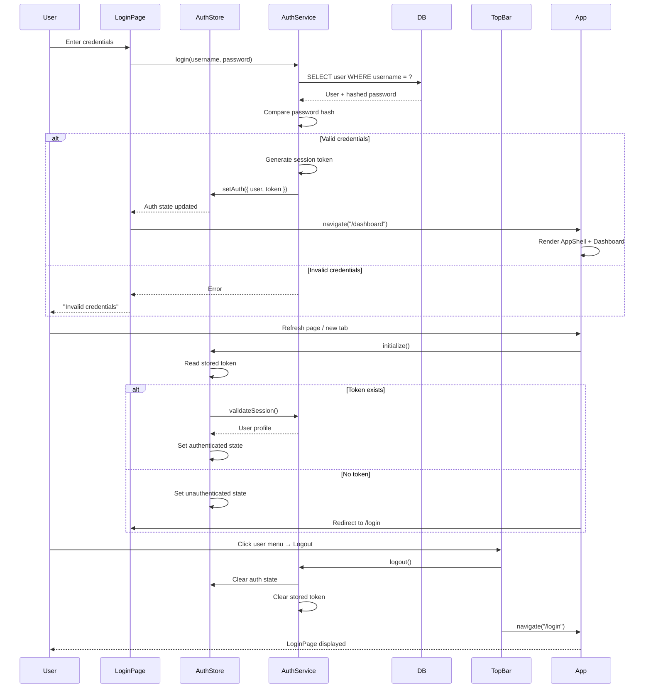
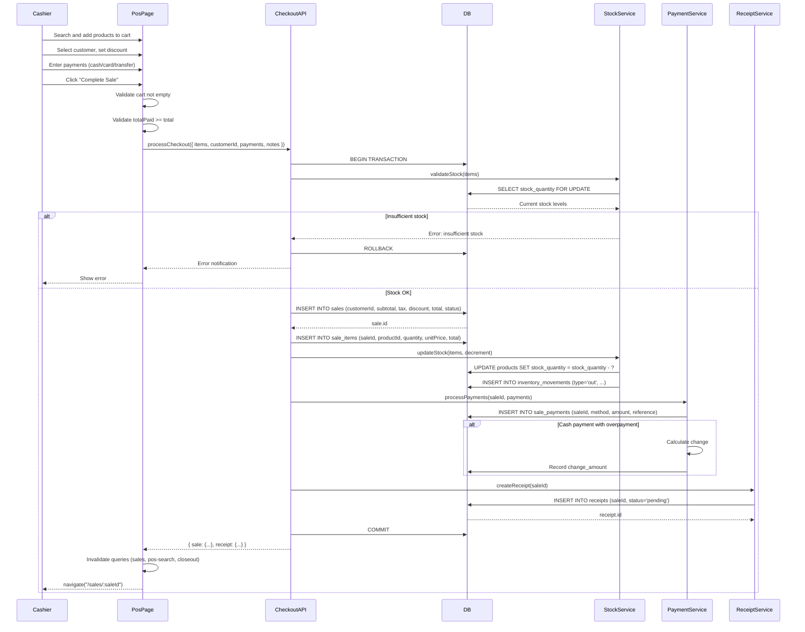
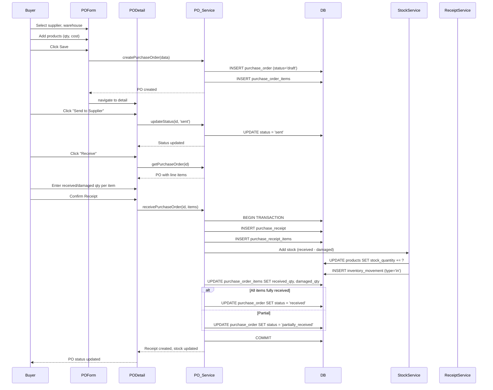
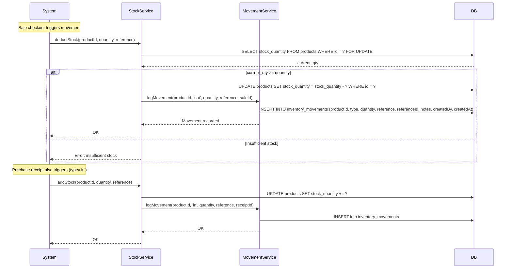
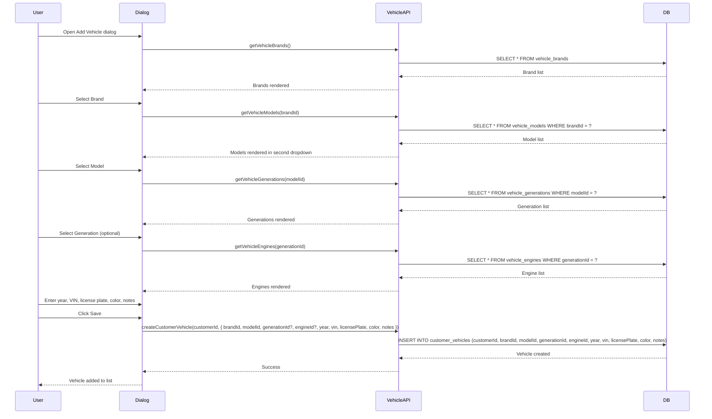
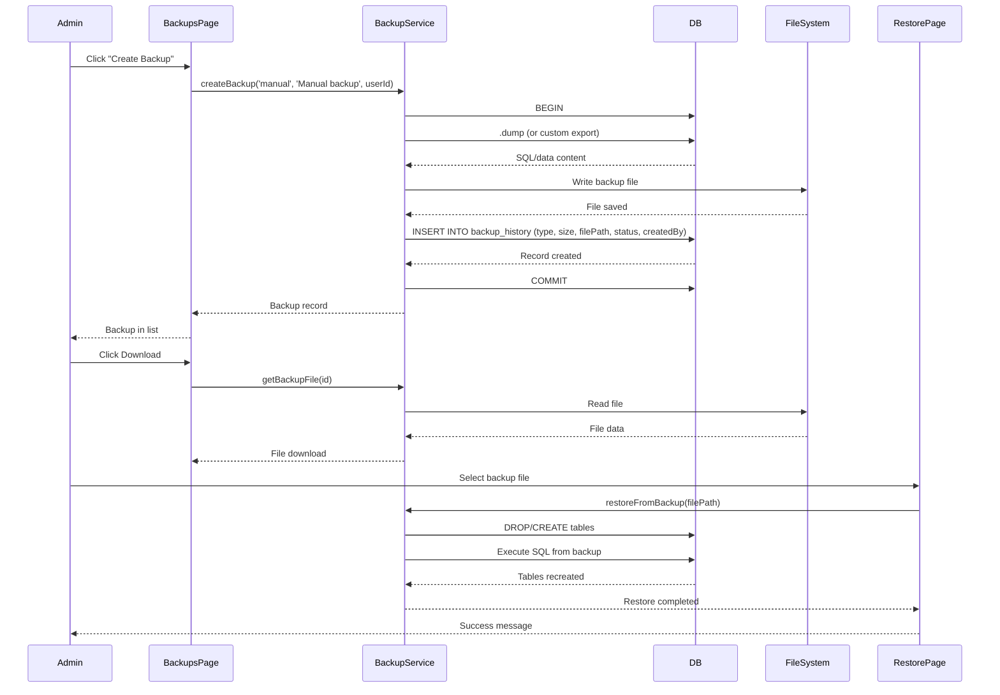
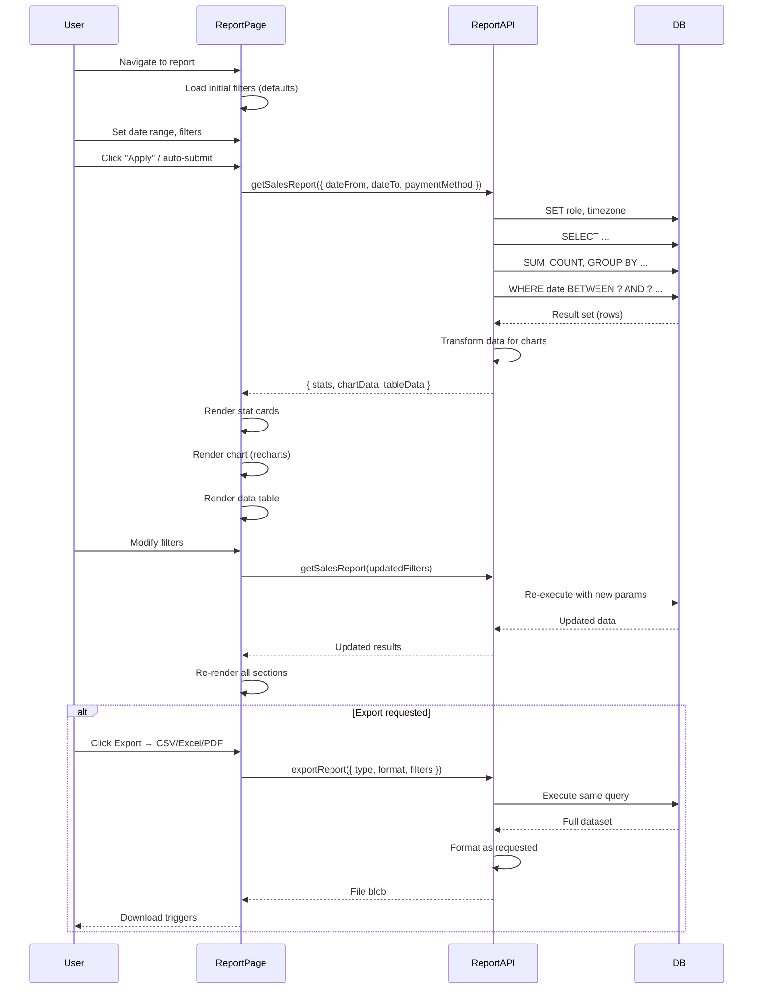
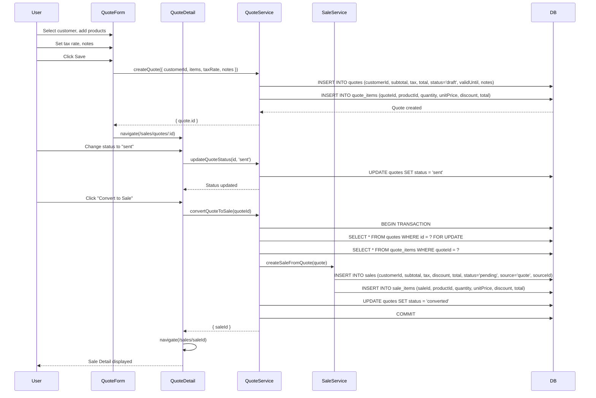

# Sequence Diagrams

> **Last updated:** 2026-07-29

---

## 1. Authentication

### Login — Session Validation — Logout

---

## 2. POS Checkout

### Full Transaction: Validate Stock → Create Sale → Update Stock → Process Payments → Create Receipt

---

## 3. Purchase Order Lifecycle

### Create → Approve → Send → Receive → Complete

---

## 4. Inventory Movement

### Sale Trigger → Auto Movement → Stock Update → History Log

---

## 5. Customer Vehicle Registration

### Select Brand → Filter Models → Select Model → Filter Generations → Enter Details → Save

---

## 6. Backup and Restore

### Create Backup → Download → Restore

---

## 7. Report Generation

### Set Filters → Execute SQL → Return Data → Render Chart/Table

---

## 8. Quote to Sale Conversion

### Create Quote → Convert → New Sale Created

---

## Index

| Diagram | Page | Description |
|---|---|---|
| 1. Authentication | Login, Session, Logout | Full auth lifecycle |
| 2. POS Checkout | `/sales/new` | Complete sale transaction with stock, payments, receipt |
| 3. Purchase Order | `/purchases/orders/:id` | PO from creation through receive |
| 4. Inventory Movement | Auto-triggered | Stock deduction and logging |
| 5. Vehicle Registration | Customer Detail → Vehicles | Cascading selection with brand/model/generation |
| 6. Backup & Restore | `/admin/backups`, `/admin/restore` | Backup creation, download, restore |
| 7. Report Generation | `/reports/*` | Filter → Query → Render → Export |
| 8. Quote to Sale | `/sales/quotes/:id` | Convert quote into sale |
