# User Workflows

> **Last updated:** 2026-07-29

---

## 1. Login

### Objective
Authenticate the user and redirect to the main dashboard.

### Preconditions
- Application is running
- User has valid credentials (or uses test role quick-login)

### Step-by-step

1. Open the application → `/login` loads
2. Enter **Username** and **Password** in the login form
3. Toggle **Remember me** if desired (default: on)
4. Click **Sign In**
5. System validates credentials against the database
6. On success: session token is stored, user is redirected to `/dashboard`
7. On failure: error message is displayed

### Sequence Diagram

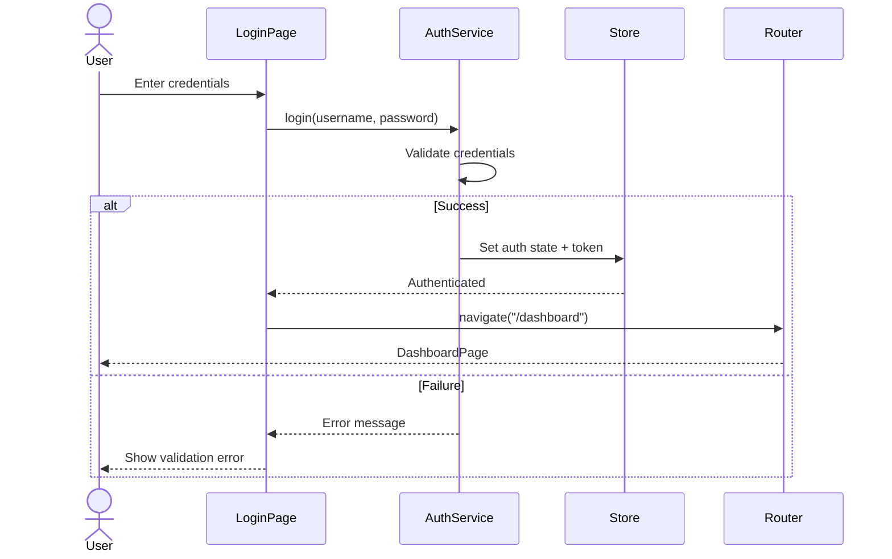

### Expected result
User is authenticated and lands on the main Dashboard with full access based on their role.

### Possible errors
- Invalid username or password → "Invalid credentials" error
- Account locked → "Account locked" message
- Network error → "Connection failed" toast
- Session expired → redirect to login

### Related workflows
- Logout (top-bar user menu → Logout)
- Forbidden page access

---

## 2. Create Product

### Objective
Add a new product to the inventory catalog.

### Preconditions
- User has inventory write permission
- Reference data exists (categories, brands, manufacturers, suppliers, warehouses)

### Step-by-step

1. Navigate: **Inventory** → **Products** (`/inventory/products`)
2. Click **Add Product** button → `/inventory/products/new`
3. Fill in **Basic Information**:
   - Product Name (required)
   - SKU (required, auto-generated or manual)
   - Barcode, OEM Number, Internal Code (optional)
   - Category, Brand, Manufacturer, Supplier (from selects)
   - Description (textarea)
4. Fill in **Pricing**:
   - Cost Price, Sale Price, Wholesale Price, Suggested Retail Price
   - Tax Rate (%)
5. Fill in **Stock**:
   - Stock Quantity, Min Stock Level, Max Stock Level, Reorder Point
   - Unit, Weight
6. Fill in **Location**:
   - Warehouse (select) → Storage Location (cascading select, filtered by warehouse)
7. Add **Image URL** (optional)
8. Click **Save**
9. On success: redirected to `/inventory/products`, success toast shown

### Sequence Diagram

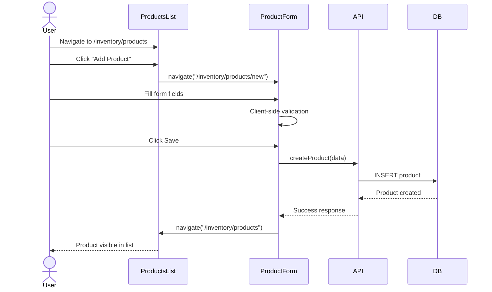

### Expected result
New product appears in the products list with all entered data and initial stock quantity.

### Possible errors
- Duplicate SKU → validation error
- Missing required fields → inline field errors
- Server error → error notification

### Related workflows
- Edit Product, View Product Detail
- Add Category, Brand, Manufacturer (prerequisite if not existing)

---

## 3. Create Sale (POS)

### Objective
Process a point-of-sale transaction from product selection through payment.

### Preconditions
- Products exist with sufficient stock
- Cash register is open (or not required)
- User has sales permission

### Step-by-step

1. Navigate: **Sales** → **Point of Sale** (`/sales/new`)
2. **Search products** using the search bar (auto-searches after 300ms debounce)
3. **Click a product card** to add it to the cart (1 unit added; click again to increment)
4. **Adjust quantities** using +/- buttons in the cart panel
5. **Remove items** with trash icon if needed
6. Optionally **select/search a customer** using the customer search field
7. **Set discount** as a percentage (0-100)
8. **Add payment methods**:
   - Default: one cash row
   - Click "+" to add more payment rows (cash/card/transfer)
   - Enter amount for each method
   - For transfers: enter reference number
9. Enter **notes** (optional)
10. Verify that **total paid ≥ total** (otherwise button is disabled)
11. Click **Complete Sale** (green button showing total)
12. System processes checkout:
    - Validates stock
    - Creates sale record
    - Updates inventory
    - Processes payments
    - Creates receipt
13. On success: redirect to sale detail page (`/sales/:id`)

### Sequence Diagram

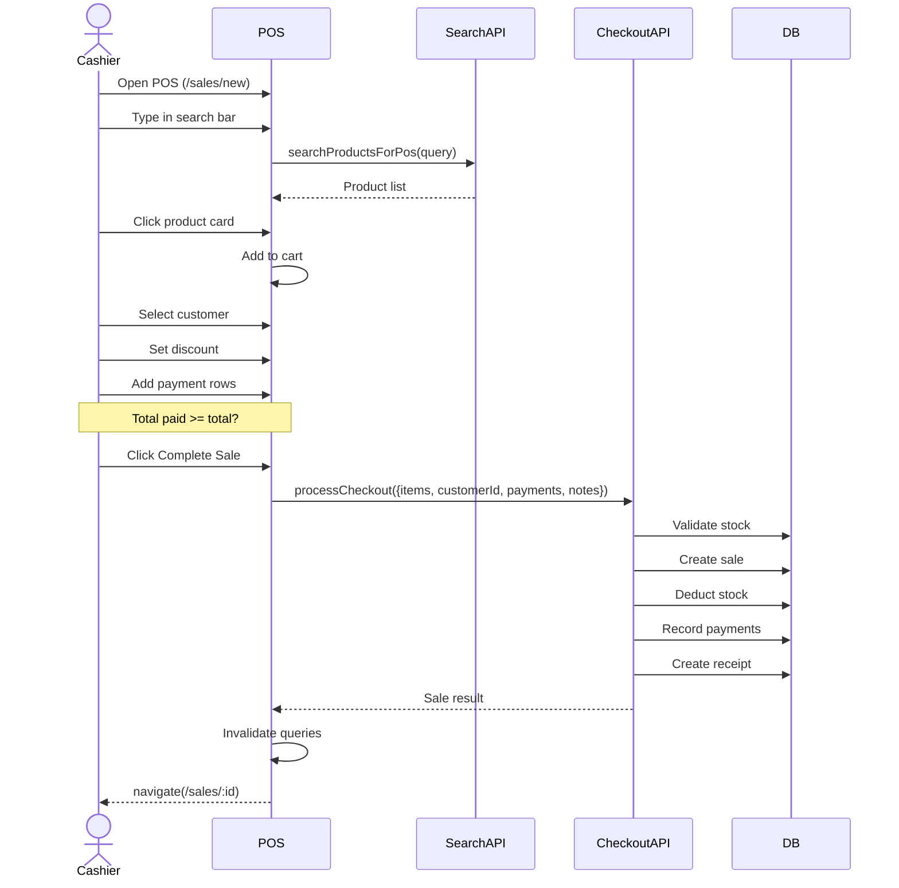

### Expected result
Sale is recorded, stock is deducted, payment is processed, and the user is shown the sale detail with receipt.

### Possible errors
- Insufficient stock → error toast during checkout
- Insufficient payment → warning toast, button disabled
- Network error → error notification
- Payment processing failure → partial state might require manual correction

### Related workflows
- Refund/Return (from Sale Detail)
- View Sales History
- Cash Register management
- Daily Closeout

---

## 4. Purchase Order (Full Lifecycle)

### Objective
Create, send, receive, and complete a purchase order to replenish inventory.

### Preconditions
- Supplier exists in the system
- Products exist in the catalog
- User has purchasing permission

### Step-by-step

1. Navigate: **Purchasing** → **Orders** (`/purchases/orders`)
2. Click **New Purchase Order** → `/purchases/orders/new`
3. **Select Supplier** from dropdown
4. **Select Warehouse** where goods will arrive
5. Set **Order Date** (default: today) and **Expected Date**
6. **Add line items**:
   - Search and select products
   - Set quantity, unit cost, discount, tax
   - Line total auto-calculates
7. Add **notes** (optional)
8. Click **Save** → PO saved as "draft"
9. From **PO Detail**, optionally click **Send to Supplier** (status → "sent")
10. When goods arrive, click **Receive** → enter received and damaged quantities per line item
11. System creates a **Purchase Receipt** and updates stock
12. PO status → "received" (or "partially_received" if partial)

### Sequence Diagram

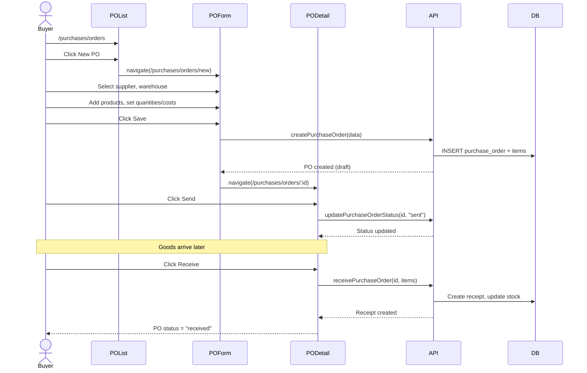

### Expected result
Products are received into inventory with correct quantities, and a purchase receipt is generated.

### Possible errors
- Duplicate PO number → validation error
- Receiving more than ordered → warning/validation
- Product not found → error during item add
- Warehouse mismatch

### Related workflows
- Purchase Returns (if goods are defective)
- View Cost History
- Reorder Suggestions (automatic PO creation)

---

## 5. Receive Purchase Order

### Objective
Record the arrival of goods against an existing purchase order.

### Preconditions
- Purchase order exists in "sent" or "approved" status
- Goods have physically arrived

### Step-by-step

1. Navigate: **Purchasing** → **Orders** (`/purchases/orders`)
2. **Find the PO** (search or scroll) and click to open detail
3. Click **Receive** button
4. For each line item, enter:
   - **Received quantity** (how many arrived in good condition)
   - **Damaged quantity** (how many arrived damaged)
5. System auto-calculates accepted = received - damaged
6. Click **Save Receipt**
7. System:
   - Creates a purchase receipt record
   - Updates product stock quantities
   - Records inventory movement (type: "in")
   - Updates PO status

### Sequence Diagram

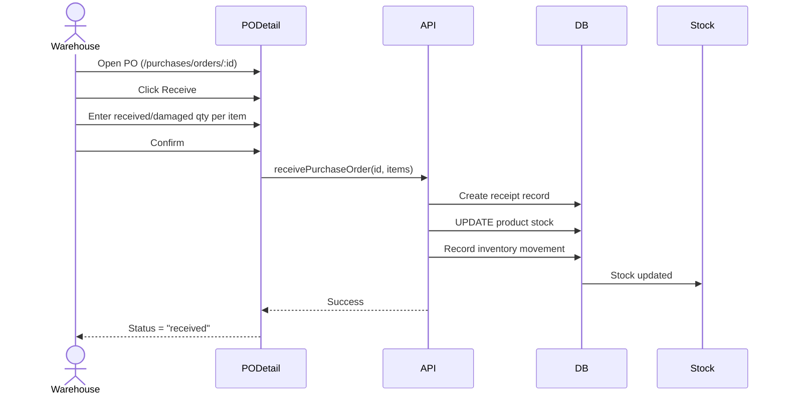

### Expected result
Stock levels are increased by the accepted quantity; a purchase receipt is created; the PO status reflects received/partial.

### Possible errors
- Receiving quantity exceeds ordered → validation
- Product not found in PO → error
- Database constraint failure

### Related workflows
- Purchase Returns (for damaged items)
- Inventory Movements (auto-logged)

---

## 6. Create Customer

### Objective
Add a new customer record to the CRM.

### Preconditions
- User has customer create permission

### Step-by-step

1. Navigate: **CRM** → **Customers** (`/crm/customers`) or **Customers** → `/customers`
2. Click **Add Customer** button
3. Fill in the dialog form:
   - Name (required)
   - Email, Phone
   - Address, City, State, Postal Code, Country
   - Notes (optional)
4. Click **Save**
5. Dialog closes, customer appears in list, success toast shown

### Sequence Diagram

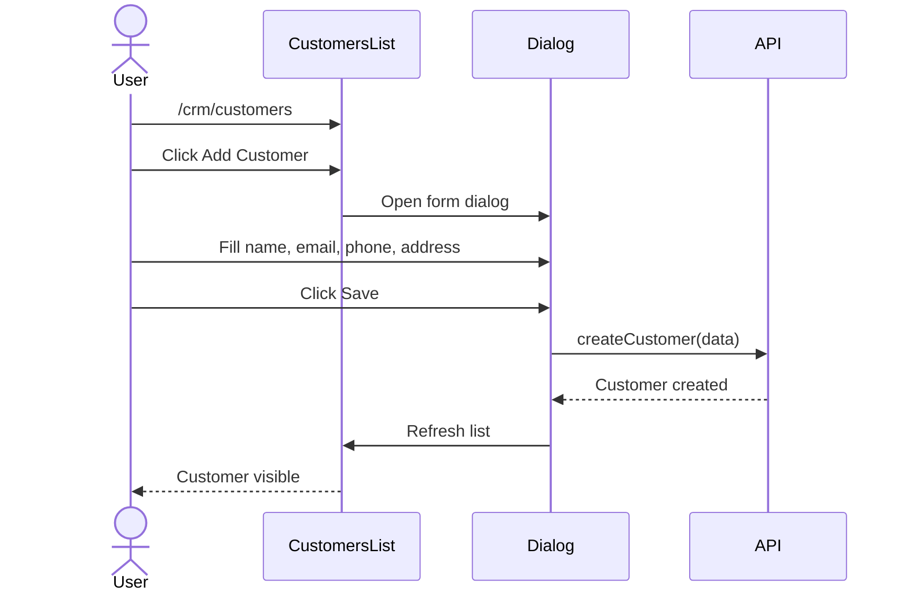

### Expected result
New customer is saved and appears in the customers list.

### Possible errors
- Duplicate email/phone → validation
- Missing name → required field error
- Server error

### Related workflows
- Edit Customer
- Create Sale with customer

---

## 7. Register Customer Vehicle

### Objective
Associate a vehicle with an existing customer.

### Preconditions
- Customer exists
- Vehicle brand and model exist in reference data (CRM Vehicles)

### Step-by-step

1. Navigate to **Customer Detail** (`/crm/customers/:id`)
2. Click the **Vehicles** tab
3. Click **Add Vehicle**
4. In the dialog:
   - **Select Brand** → system filters available models
   - **Select Model** → system filters generations (if available)
   - **Select Generation** → system filters engines
   - Enter **Year**, **VIN**, **License Plate**, **Color**, **Notes**
5. Click **Save**
6. Vehicle appears in the customer's vehicle list

### Sequence Diagram

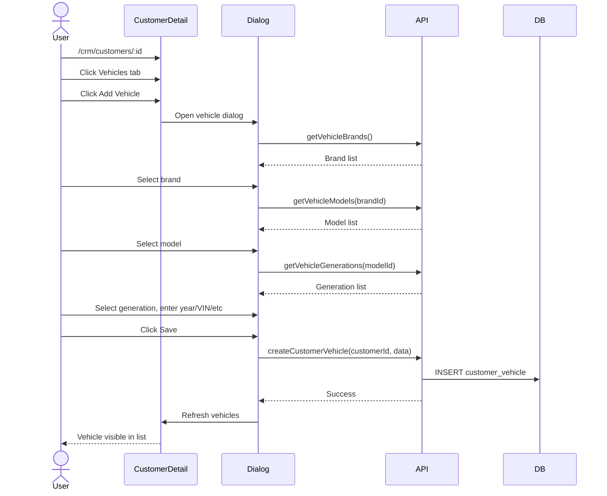

### Expected result
Vehicle is registered and linked to the customer, appearing in the vehicles tab.

### Possible errors
- Brand/model doesn't exist → user must add via CRM Vehicles first
- Duplicate VIN → validation
- Missing required fields

### Related workflows
- CRM Vehicles (add reference brands/models)
- Create Service Reminder for vehicle

---

## 8. Create Service Reminder

### Objective
Schedule a service reminder for a customer's vehicle.

### Preconditions
- Customer and vehicle exist

### Step-by-step

1. Navigate: **CRM** → **Reminders** (`/crm/reminders`)
2. Click **New Reminder**
3. In the dialog:
   - **Customer**: search/select the customer
   - **Title**: brief description
   - **Type**: select from oil_change, tire_rotation, brake_inspection, battery_check, coolant_flush, transmission_service, timing_belt, general_inspection, other
   - **Description**: optional details
   - **Due Date**: when the service is due
   - **Due Mileage**: optional mileage-based reminder
   - **Notes**: optional
4. Click **Save**
5. Reminder appears in the list with status "pending"

### Sequence Diagram

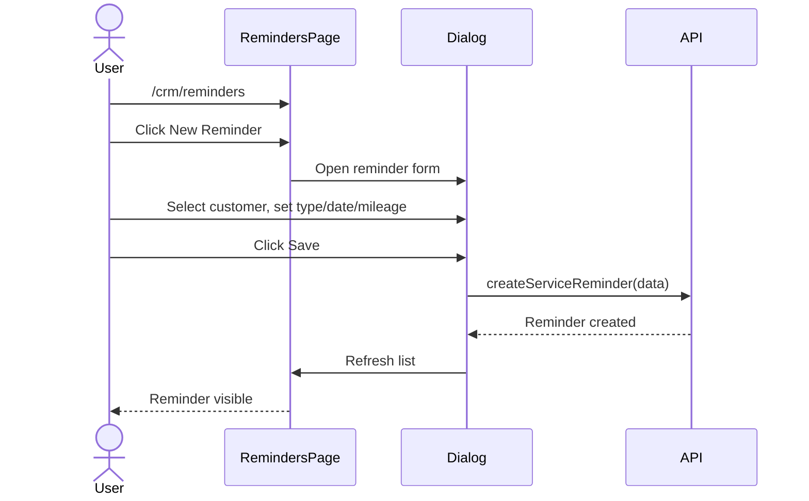

### Expected result
Reminder is created with "pending" status and will appear in upcoming reminders on the CRM dashboard.

### Possible errors
- Customer not found → validation
- Invalid date format
- Missing required fields

### Related workflows
- Mark reminder as completed/dismissed
- CRM Dashboard (upcoming reminders widget)

---

## 9. Run Report

### Objective
Generate, view, and export a business report.

### Preconditions
- Relevant data exists (sales, inventory, etc.)

### Step-by-step

1. Navigate: **Reports** → select a report type from the sidebar (e.g., **Sales** → `/reports/sales`)
2. Optionally **set filters**:
   - Date range (from/to)
   - Warehouse, Category, Brand (where applicable)
   - Payment method (sales reports)
3. Click **Apply** or report auto-loads
4. System executes SQL query, returns data
5. **View results**:
   - Stat cards for summary metrics
   - Charts (bar, pie, line, area)
   - Data tables
6. Optionally **export**:
   - Click Export button
   - Select format (CSV, Excel, PDF)
   - File downloads

### Sequence Diagram

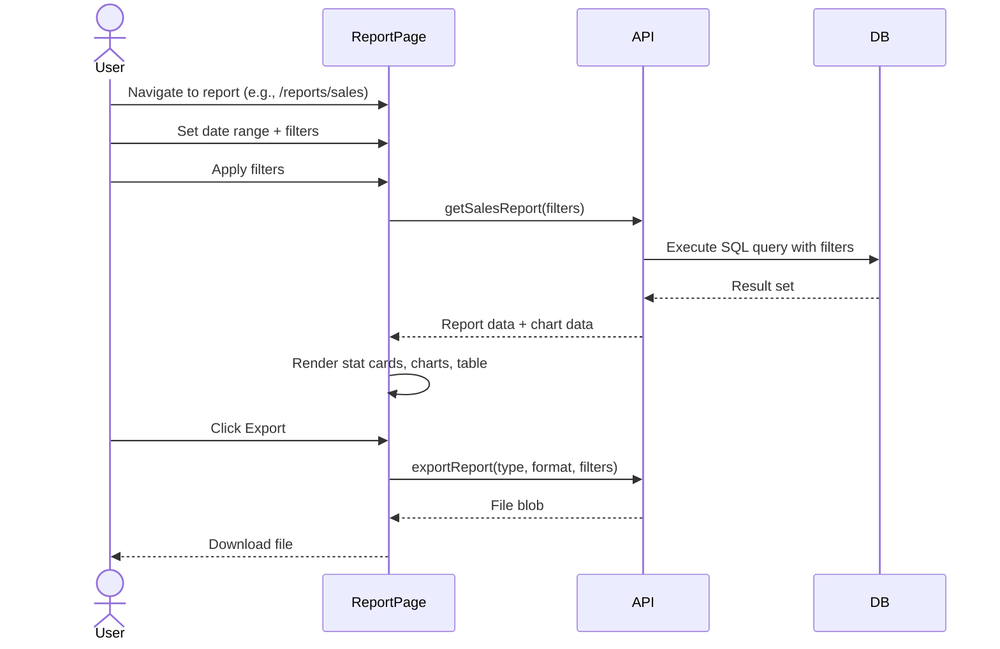

### Expected result
Report displays with accurate data matching the filters; export downloads in the selected format.

### Possible errors
- No data for selected filters → empty state
- Invalid date range → validation
- SQL execution error → error message
- Export failure

### Related workflows
- Scheduled Reports (automated email delivery)
- Custom Reports (SQL builder)
- Exports page (download history)

---

## 10. Backup Database

### Objective
Create a manual backup of the application database.

### Preconditions
- User has admin permission

### Step-by-step

1. Navigate: **Admin** → **Backups** (`/admin/backups`)
2. Review the backup statistics (total backups, total size, last backup)
3. Click **Create Backup** button
4. System creates a backup:
   - Type: "manual"
   - Timestamp is recorded
   - File size is calculated
5. New backup appears in the table with status "completed"
6. Optionally **Download** the backup file or **Delete** old backups

### Sequence Diagram

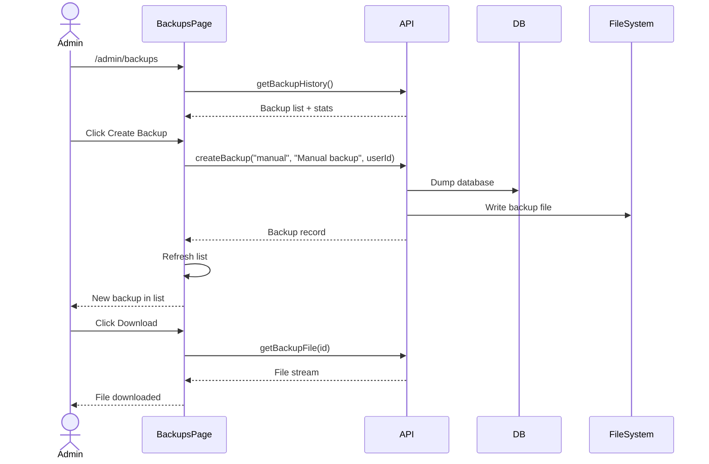

### Expected result
A backup file is created, stored on the filesystem, and listed in the backups table.

### Possible errors
- Disk space full → error
- Database connection lost → error
- File system permission denied → error

### Related workflows
- Restore from backup
- Automatic scheduled backups

---

## 11. Manage Users

### Objective
Create or edit a system user with role-based permissions.

### Preconditions
- User has admin permission
- Roles exist in the system

### Step-by-step

1. Navigate: **Admin** → **Users** (`/admin/users`)
2. Click **Add User** or click **Edit** on an existing user
3. Fill in the form:
   - Full Name, Email, Username
   - Password (for new users only)
   - Role (select from existing roles)
   - Is Active (toggle)
4. Click **Save**
5. User is created/updated in the system
6. From the Users list, additional actions:
   - **Lock/Unlock** to disable login temporarily
   - **Archive/Restore** to soft-delete
   - **Reset Password** to force password change

### Sequence Diagram

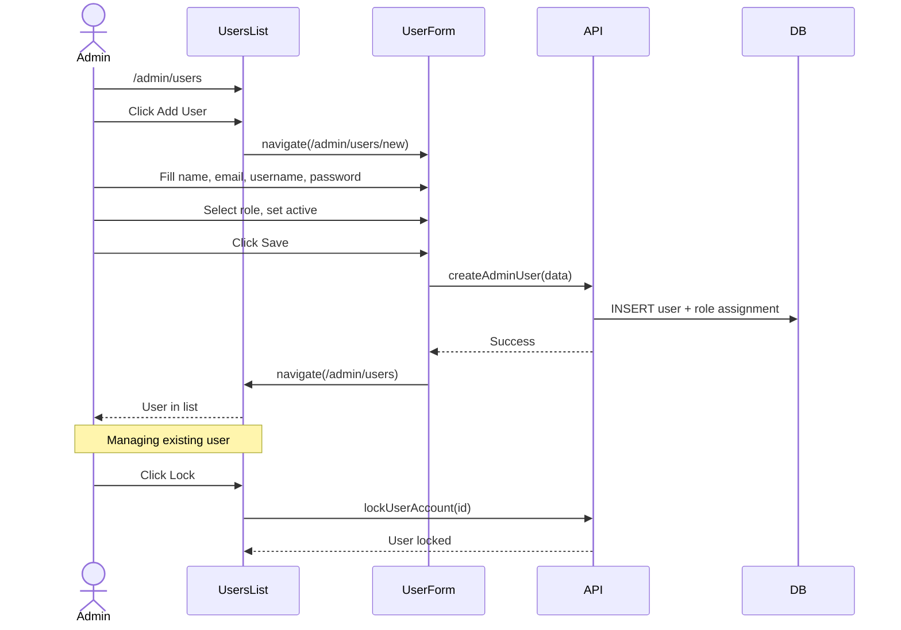

### Expected result
User is created with the specified role and can log in with the set credentials.

### Possible errors
- Duplicate username → validation error
- Weak password → validation
- Missing required fields

### Related workflows
- Roles management (create/edit roles with permissions)
- Login

---

## 12. Create Quote → Convert to Sale

### Objective
Create a price quote for a customer and optionally convert it to a sale.

### Preconditions
- Products exist
- Customer exists (optional but recommended)

### Step-by-step

1. Navigate: **Sales** → **Quotes** (`/sales/quotes`)
2. Click **New Quote** → `/sales/quotes/new`
3. **Select customer** (optional, using customer search)
4. **Add line items**:
   - Search products and click to add
   - Adjust quantity as needed
5. Set **tax rate**
6. Add **notes** (optional)
7. Click **Save**
8. Quote is saved with status "draft"
9. From **Quote Detail**, optionally change status to "sent"
10. To convert: Click **Convert to Sale**
11. System creates a new sale from the quote data and redirects to the sale detail

### Sequence Diagram

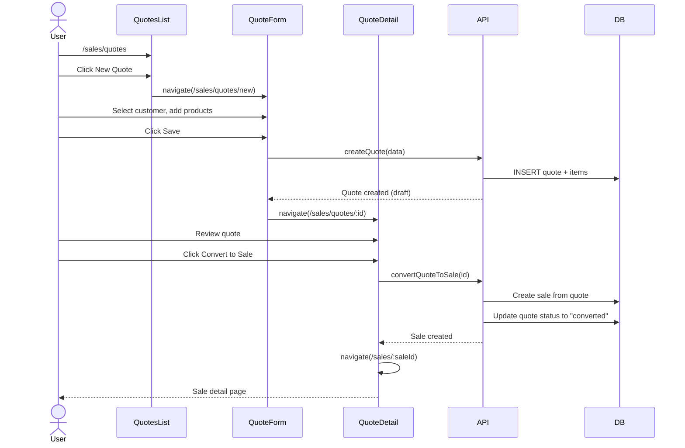

### Expected result
Quote is created and saved. When converted, a new sale is generated with the same items and customer, and the quote status changes to "converted".

### Possible errors
- Products removed from catalog after quote creation → error during conversion
- Customer deleted → warning
- Insufficient stock at conversion time → warning but still allows

### Related workflows
- Create Sale (POS) — similar flow but immediate payment
- Edit Quote
- Delete Quote
